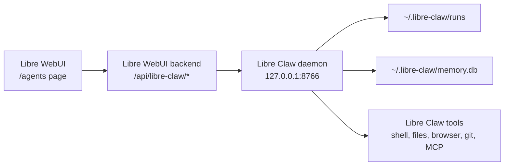

# Libre Claw Integration

Libre WebUI includes a native integration for
[Libre Claw](https://github.com/kroonen-ai/libre-claw), Kroonen AI's local
agent harness. Libre Claw is exposed as a first-class agent surface inside
Libre WebUI rather than as a generic completion-provider plugin.

Libre Claw remains the runtime that owns the powerful agent behavior:

- durable runs and JSONL event logs
- file, shell, git, browser, HTTP, web search, MCP, and schedule tools
- approval requests before side effects
- persistent memory and project/user skills
- goal mode
- fallback model routes
- usage reports
- daemon-owned automations and Telegram delivery
- the standalone local dashboard

Libre WebUI talks to the Libre Claw daemon over HTTP and exposes those features
inside the normal authenticated WebUI shell.

## Architecture



The WebUI backend never runs shell commands or browser tools directly for Libre
Claw. It proxies authenticated admin requests to the local daemon and displays
the daemon's run state, events, approvals, automations, usage, and configuration.

## Start Libre Claw

Install Libre Claw:

```bash
git clone https://github.com/kroonen-ai/libre-claw.git
cd libre-claw
python3 -m venv .venv
source .venv/bin/activate
python -m pip install --upgrade pip
python -m pip install -e ".[dev]"
```

Start the daemon:

```bash
libre-claw start
```

The default dashboard and API are available at:

```text
http://127.0.0.1:8766/dashboard
```

Then open **Libre WebUI → Libre Claw**.

## Backend Environment

Libre WebUI uses the local daemon URL by default:

```bash
LIBRE_CLAW_BASE_URL=http://127.0.0.1:8766
LIBRE_CLAW_TIMEOUT_MS=30000
```

Set `LIBRE_CLAW_BASE_URL` if the daemon runs on another host, a Tailscale IP, or
a reverse-proxied local service.

## WebUI Routes

All Libre Claw routes require an authenticated admin user because they can reveal
local file paths and trigger agent work:

| WebUI route                                             | Libre Claw feature                     |
| ------------------------------------------------------- | -------------------------------------- |
| `GET /api/libre-claw/status`                            | Daemon health, base URL, dashboard URL |
| `GET /api/libre-claw/config/model`                      | Current provider/model                 |
| `PATCH /api/libre-claw/config/model`                    | Update provider/model                  |
| `GET /api/libre-claw/config/fallback`                   | Current fallback route                 |
| `PATCH /api/libre-claw/config/fallback`                 | Update fallback route                  |
| `PATCH /api/libre-claw/config/theme`                    | Update dashboard/TUI theme             |
| `GET /api/libre-claw/runs`                              | List durable runs                      |
| `POST /api/libre-claw/runs`                             | Start chat or goal-mode run            |
| `GET /api/libre-claw/runs/:id`                          | Run metadata and artifacts             |
| `GET /api/libre-claw/runs/:id/events`                   | Incremental run events                 |
| `POST /api/libre-claw/runs/:id/cancel`                  | Cancel a run                           |
| `POST /api/libre-claw/runs/:id/permissions/:toolCallId` | Approve or deny a tool call            |
| `GET /api/libre-claw/usage`                             | Usage summary and records              |
| `GET /api/libre-claw/automations`                       | List scheduled automations             |
| `POST /api/libre-claw/automations`                      | Create automation                      |
| `PATCH /api/libre-claw/automations/:id`                 | Update automation                      |
| `POST /api/libre-claw/automations/:id/run`              | Run automation now                     |
| `POST /api/libre-claw/automations/:id/pause`            | Pause automation                       |
| `POST /api/libre-claw/automations/:id/resume`           | Resume automation                      |
| `DELETE /api/libre-claw/automations/:id`                | Delete automation                      |

## Starting Runs

The WebUI page can start:

- **Chat runs** — normal Libre Claw agent turns.
- **Goal runs** — bounded autopilot mode where Libre Claw continues until its
  judge marks the goal complete or it reaches the configured limit.

Optional provider/model overrides are passed through to Libre Claw for that run.
If omitted, Libre Claw uses its configured default provider and model.

## Approvals

When Libre Claw asks for permission, WebUI shows the pending tool call and lets an
admin choose:

- `allow_once`
- `deny`
- `always_allow_tool`

Libre Claw still owns the permission model and safety checks. WebUI only records
the admin's choice through the daemon API.

## Automations

Libre WebUI can create and manage Libre Claw daemon automations:

- report automations
- Telegram-routed automations
- pause/resume
- run now
- delete

These are Libre Claw automations, not host cron jobs. Reports and execution
history remain in Libre Claw's run store.

## Memory, Skills, Soul, And Tools

Memory, skills, soul files, MCP tools, browser tools, SearXNG, Petdex, and
Telegram are configured in Libre Claw itself. WebUI displays and controls the
daemon-facing features without duplicating Libre Claw's internal configuration
system.

Useful Libre Claw commands:

```text
/memory status
/skills list
/soul status
/tools list
/workspace status
/telegram
/petdex status
```

## Troubleshooting

### WebUI Shows "Libre Claw daemon is not connected"

Start the daemon:

```bash
libre-claw start
```

Or set the backend URL:

```bash
LIBRE_CLAW_BASE_URL=http://127.0.0.1:8766
```

### Permission Buttons Do Nothing

The run may have already finished or the permission may have been resolved from
another surface, such as the Libre Claw dashboard or Telegram bridge. Refresh the
WebUI page and inspect the run timeline.

### A Tool Was Denied

Libre Claw's permission manager is authoritative. Check Libre Claw's own config
and run events if a call is denied before WebUI sees an approval request.

### Automations Do Not Run

Check Libre Claw daemon status and automation config:

```bash
libre-claw status
libre-claw start
```

The daemon must be running for scheduled automations and Telegram delivery.
