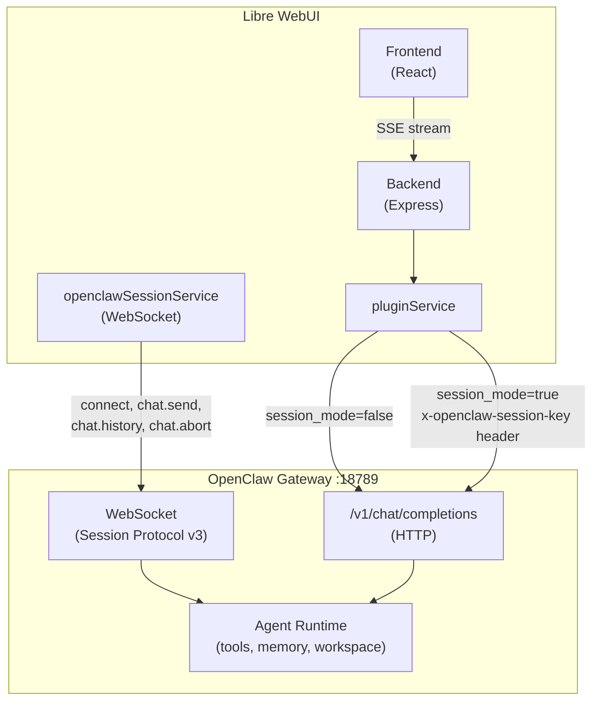
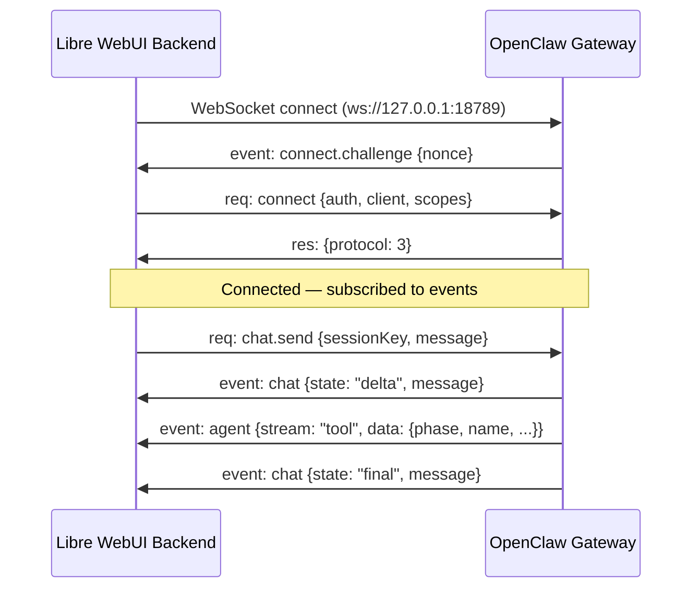

# OpenClaw Integration

Libre WebUI connects to the [OpenClaw](https://openclaw.dev) gateway as an AI provider plugin, giving users access to OpenClaw's full agent capabilities — tools (exec, browser, file ops, web search), memory, skills, and workspace — through the standard chat interface.

The integration supports two modes:

- **Session Mode (default)** — Messages are routed through a persistent OpenClaw agent session via WebSocket. The agent has access to all tools, workspace files, and memory.
- **Stateless HTTP Mode** — Standard OpenAI-compatible `/v1/chat/completions` requests without session persistence or tool access.

## Architecture



### How It Works

1. **Plugin system** — The `openclaw-agent` plugin is a JSON file in `plugins/` that declares the endpoint, auth, models, and configurable variables.
2. **Model routing** — When a user selects a Claude model (e.g. `anthropic/claude-sonnet-4-20250514`), `pluginService` finds the OpenClaw plugin via `model_map` and routes the request through it.
3. **Session header** — When `session_mode` is enabled (default), the backend adds an `x-openclaw-session-key` header to HTTP requests, telling the gateway to route the message through the named agent session.
4. **WebSocket service** — `openclawSessionService` maintains a persistent WebSocket connection for real-time events (chat deltas, tool call streaming, connection state).
5. **Streaming** — Responses stream back as SSE (Server-Sent Events) in OpenAI-compatible format, including tool call deltas.

## Setup

### 1. Ensure OpenClaw Gateway Is Running

The OpenClaw gateway must be running and accessible on port **18789** (default):

```bash
openclaw gateway status
# If not running:
openclaw gateway start
```

Verify it's reachable:

```bash
curl http://127.0.0.1:18789/v1/models
```

### 2. Install the Libre WebUI Plugin

The plugin file `plugins/openclaw-agent.json` is included in this repo. If you need to recreate it:

```json
{
  "id": "openclaw-agent",
  "name": "OpenClaw Agent",
  "type": "completion",
  "endpoint": "http://127.0.0.1:18789/v1/chat/completions",
  "auth": {
    "header": "Authorization",
    "prefix": "Bearer ",
    "key_env": "OPENCLAW_API_KEY"
  },
  "model_map": [
    "anthropic/claude-opus-4-6",
    "anthropic/claude-sonnet-4-20250514",
    "anthropic/claude-haiku-3-5-20241022"
  ],
  "variables": [
    {
      "name": "session_mode",
      "type": "boolean",
      "label": "Session Mode",
      "description": "Route messages through a persistent agent session (tools, memory, workspace).",
      "default": true
    },
    {
      "name": "session_key",
      "type": "string",
      "label": "Session Key",
      "description": "Which agent session to use. 'main' is the default.",
      "default": "main"
    },
    {
      "name": "endpoint",
      "type": "string",
      "label": "OpenClaw Gateway URL",
      "description": "Override the gateway endpoint URL.",
      "default": "http://127.0.0.1:18789/v1/chat/completions"
    },
    {
      "name": "temperature",
      "type": "number",
      "label": "Temperature",
      "default": 0.7,
      "min": 0,
      "max": 2
    },
    {
      "name": "stream",
      "type": "boolean",
      "label": "Enable Streaming",
      "description": "Stream responses via SSE.",
      "default": true
    },
    {
      "name": "system_prompt_prefix",
      "type": "string",
      "label": "System Prompt Prefix",
      "description": "Text prepended as a system message to every conversation.",
      "default": ""
    },
    {
      "name": "user_name",
      "type": "string",
      "label": "User Name",
      "description": "Your name, passed to the agent.",
      "default": ""
    }
  ]
}
```

### 3. Configure Authentication

Set the OpenClaw API key using **one** of these methods:

**Option A: Environment variable** (in `backend/.env`):

```env
OPENCLAW_API_KEY=your-openclaw-api-key
```

**Option B: Per-user in the UI:**

Go to **Settings → Plugins → OpenClaw Agent → Configure** and enter your API key.

API keys are stored encrypted in the database (`plugin_credentials` table) using AES-256 encryption. Environment variables serve as a fallback.

### 4. Activate and Chat

1. Go to **Settings → Plugins** and toggle **OpenClaw Agent** on
2. Select a model from the chat model selector:
   - `anthropic/claude-opus-4-6` — Most capable, deep reasoning
   - `anthropic/claude-sonnet-4-20250514` — Balanced speed and capability
   - `anthropic/claude-haiku-3-5-20241022` — Fast and lightweight

Models are auto-discovered from the gateway's `/v1/models` endpoint when the plugin is activated.

## Available Models

| Model | Description | Best For |
|-------|-------------|----------|
| `anthropic/claude-opus-4-6` | Opus-class (deep reasoning) | Complex analysis, code architecture |
| `anthropic/claude-sonnet-4-20250514` | Sonnet-class (balanced) | General use, coding, writing |
| `anthropic/claude-haiku-3-5-20241022` | Haiku-class (fast) | Quick tasks, summaries |

## Plugin Variables

All variables are configurable per-user via **Settings → Plugins → OpenClaw Agent → Configure** (the gear icon). Values are stored encrypted in SQLite and cached with a 5-second TTL.

| Variable | Type | Default | Description |
|----------|------|---------|-------------|
| `session_mode` | boolean | `true` | Enable persistent agent session with full tool access |
| `session_key` | string | `"main"` | Agent session identifier (e.g. `main`, `work`, `research`) |
| `endpoint` | string | `http://127.0.0.1:18789/v1/chat/completions` | Gateway endpoint URL override |
| `temperature` | number | `0.7` | Sampling temperature (0–2) |
| `stream` | boolean | `true` | Enable SSE streaming |
| `system_prompt_prefix` | string | `""` | System message prepended to every conversation |
| `user_name` | string | `""` | User's name, passed to the agent for personalization |

## WebSocket Session Protocol

When `session_mode` is enabled, `openclawSessionService` establishes a WebSocket connection to the gateway for real-time event streaming. This is a singleton service in the backend.

### Connection Lifecycle



### Frame Format

All frames are JSON with a `type` field:

```typescript
// Request frame (client → gateway)
{ type: "req", id: "uuid", method: "chat.send", params: { ... } }

// Response frame (gateway → client)
{ type: "res", id: "uuid", ok: true, payload: { ... } }

// Event frame (gateway → client, unsolicited)
{ type: "event", event: "chat", payload: { ... } }
```

### Authentication

The gateway sends a `connect.challenge` event with a nonce on WebSocket open. The client responds with a `connect` request containing:

```typescript
{
  minProtocol: 3,
  maxProtocol: 3,
  client: { id: "libre-webui", version: "1.0.0", platform: "node", mode: "webchat" },
  role: "operator",
  scopes: ["operator.read", "operator.write"],
  auth: { token: "your-api-key" }
}
```

### Available Methods

| Method | Description | Parameters |
|--------|-------------|------------|
| `connect` | Authenticate and establish session | `auth`, `client`, `scopes`, `role` |
| `chat.send` | Send a message to the agent | `sessionKey`, `message`, `deliver`, `idempotencyKey` |
| `chat.abort` | Abort the current agent run | `sessionKey`, `runId` (optional) |
| `chat.history` | Fetch conversation history | `sessionKey`, `limit` |

### Reconnection

The service automatically reconnects on disconnect with exponential backoff:

- Initial delay: **800ms**
- Multiplier: **1.7×** per attempt
- Max delay: **15 seconds**
- Backoff resets on successful connection

### Event Types

| Event | Description |
|-------|-------------|
| `connect.challenge` | Gateway authentication challenge |
| `chat` | Chat delta/final/aborted/error states |
| `agent` | Agent runtime events (tool streaming) |

## Tool Streaming

When the agent invokes tools (exec, web search, file ops, browser, etc.), real-time progress events are streamed via the `agent` event channel:

```typescript
export interface ToolStreamEvent {
  toolCallId: string;  // Unique ID for this tool invocation
  name: string;        // Tool name (e.g. "exec", "web_search", "Read")
  phase: string;       // "start" | "update" | "result"
  args?: unknown;      // Tool input arguments (on start)
  result?: unknown;    // Final result (on result phase)
  partialResult?: unknown; // Incremental output (on update phase)
}
```

These events arrive as `agent` frames with `stream: "tool"`:

```json
{
  "type": "event",
  "event": "agent",
  "payload": {
    "stream": "tool",
    "runId": "abc-123",
    "sessionKey": "main",
    "data": {
      "toolCallId": "tc_001",
      "name": "exec",
      "phase": "start",
      "args": { "command": "ls -la" }
    }
  }
}
```

The `openclawSessionService` parses these into `ToolStreamEvent` objects and emits them to subscribers via the `tool` event type.

## Chat Delta Events

Chat responses stream as `ChatDeltaEvent` objects:

```typescript
export interface ChatDeltaEvent {
  runId: string;         // Current run identifier
  sessionKey: string;    // Session the response belongs to
  state: "delta" | "final" | "aborted" | "error";
  message?: unknown;     // Message content (text blocks)
  errorMessage?: string; // Error details (on error state)
}
```

The helper `extractTextFromMessage()` extracts plain text from gateway message objects, supporting both direct `text`/`content` string fields and Anthropic-style content block arrays.

## HTTP Streaming (Stateless Mode)

When `session_mode` is disabled (or for the SSE streaming path), `pluginService` makes standard HTTP requests:

```
POST http://127.0.0.1:18789/v1/chat/completions
Authorization: Bearer <api-key>
Content-Type: application/json

{
  "model": "anthropic/claude-sonnet-4-20250514",
  "messages": [...],
  "stream": true,
  "temperature": 0.7
}
```

Streaming responses use the standard OpenAI SSE format (`data: {...}\n\n`), including `tool_calls` deltas that are accumulated across chunks by `executePluginStreamRequest()`.

When `session_mode` is enabled, the backend adds:

```
x-openclaw-session-key: main
```

This tells the gateway to route the completion through the named agent session, giving it access to tools and workspace even over HTTP.

## Plugin System Details

### Credential Storage

API keys are stored in two places (checked in order):

1. **Database** — `plugin_credentials` table, AES-256 encrypted per user
2. **Environment** — `OPENCLAW_API_KEY` env var (fallback)

Manage via:
- `POST /api/plugins/:id/credentials` — Set API key
- `DELETE /api/plugins/:id/credentials` — Remove API key
- `GET /api/plugins/:id/credentials/check` — Check if key exists (no reveal)

### Variable Storage

Plugin variables are stored in the `plugin_variables` table with per-user scoping. Sensitive variables are encrypted. The `pluginVariablesService` provides:

- **5-second TTL cache** for resolved values (avoids DB reads on every request)
- **Type validation** against the JSON schema (number ranges, URL format for endpoints, etc.)
- **SSRF protection** — endpoint overrides are validated to allow only HTTPS, localhost, or private network IPs

Manage via:
- `GET /api/plugins/:id/variables` — Get values (sensitive values masked)
- `PUT /api/plugins/:id/variables` — Set values (validated against schema)
- `DELETE /api/plugins/:id/variables` — Reset to defaults

### Model Discovery

When the plugin is activated, `pluginService.discoverModels()` calls `GET {baseUrl}/v1/models` in the background and updates the `model_map` in the plugin JSON file. This keeps the available models in sync with whatever the gateway exposes.

## Security

- **Encrypted credentials** — API keys are AES-256 encrypted at rest in SQLite
- **Localhost binding** — Default endpoint is `127.0.0.1:18789` (same-machine only)
- **SSRF protection** — Endpoint overrides validated (HTTPS required for non-local/non-private IPs)
- **Rate limiting** — Plugin API routes are rate-limited (100 req/15min general, 10 req/15min for uploads)
- **Input validation** — Model names sanitized against path traversal; variable values validated against schema

## Troubleshooting

**Plugin not appearing in model list:**
- Verify the gateway is running: `openclaw gateway status`
- Check connectivity: `curl http://127.0.0.1:18789/v1/models`
- Ensure `plugins/openclaw-agent.json` exists and is valid JSON

**Authentication errors:**
- Check that `OPENCLAW_API_KEY` is set in `backend/.env`, or configured in Settings
- Verify the key is valid: `curl -H "Authorization: Bearer $OPENCLAW_API_KEY" http://127.0.0.1:18789/v1/models`

**No tool access / stateless responses:**
- Verify `session_mode` is `true` in plugin variables (Settings → Plugins → OpenClaw Agent → Configure)
- Check the `session_key` value (default: `main`)
- Look at gateway logs for session routing

**WebSocket not connecting:**
- Check gateway logs for WebSocket upgrade errors
- The service derives the WS URL from the HTTP endpoint (`http:` → `ws:`, strips `/v1/chat/completions`)
- Reconnection is automatic with backoff; check backend logs for `[OpenClawSession]` messages

**Streaming not working:**
- Ensure `stream` variable is `true` in plugin settings
- The backend uses `fetch()` with `ReadableStream` for SSE parsing
- Check for proxy/reverse-proxy buffering issues
