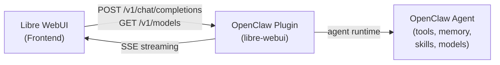

# OpenClaw Integration

Libre WebUI can connect to OpenClaw as an AI provider, giving users access to OpenClaw's full agent capabilities — tools, memory, skills, and multi-model routing — through the standard chat interface.

## Architecture



The integration uses an OpenClaw plugin that starts an OpenAI-compatible HTTP server. Libre WebUI connects to it as a standard completion plugin — no code changes required.

## Setup

### 1. Install the OpenClaw Plugin

Copy the `libre-webui` extension to `~/.openclaw/extensions/libre-webui/` and enable it:

```yaml
plugins:
  entries:
    libre-webui:
      enabled: true
      config:
        port: 11435
        host: "127.0.0.1"
        apiKey: "your-shared-secret"
        defaultModel: "anthropic/claude-sonnet-4-20250514"
        enableTools: true
```

Restart the OpenClaw gateway.

### 2. Install the Libre WebUI Plugin

Copy `plugins/openclaw-agent.json` (included in this repo) or create it manually:

```json
{
  "id": "openclaw-agent",
  "name": "OpenClaw Agent",
  "type": "completion",
  "endpoint": "http://localhost:11435/v1/chat/completions",
  "auth": {
    "header": "Authorization",
    "prefix": "Bearer ",
    "key_env": "OPENCLAW_BRIDGE_API_KEY"
  },
  "model_map": [
    "openclaw/agent",
    "openclaw/agent-fast",
    "openclaw/agent-reasoning"
  ]
}
```

### 3. Configure Authentication

Set the shared secret as an environment variable in Libre WebUI's `backend/.env`:

```env
OPENCLAW_BRIDGE_API_KEY=your-shared-secret
```

Or configure it per-user in **Settings → Plugins → OpenClaw Agent → Configure**.

### 4. Start Chatting

1. Go to **Settings → Plugins** and enable **OpenClaw Agent**
2. Select one of the OpenClaw models in the chat model selector:
   - **openclaw/agent** — Default model
   - **openclaw/agent-fast** — Optimized for speed
   - **openclaw/agent-reasoning** — Deep reasoning tasks

## Available Models

| Model | Description | Best For |
|-------|-------------|----------|
| `openclaw/agent` | Default agent with configured model | General use |
| `openclaw/agent-fast` | Fast responses (Sonnet-class) | Quick tasks, chat |
| `openclaw/agent-reasoning` | Deep reasoning (Opus-class) | Complex analysis, code |

## Configuration Reference

### OpenClaw Plugin Config

| Option | Type | Default | Description |
|--------|------|---------|-------------|
| `port` | number | `11435` | API server port |
| `host` | string | `127.0.0.1` | Bind address |
| `apiKey` | string | — | Shared authentication secret |
| `defaultModel` | string | `anthropic/claude-sonnet-4-20250514` | Model for `openclaw/agent` |
| `enableTools` | boolean | `true` | Expose OpenClaw tools |

## Security

- **Shared secret** — API key authentication between Libre WebUI and OpenClaw
- **Localhost binding** — Default binds to `127.0.0.1` (same-machine only)
- **CORS** — Configured for local development; restrict in production

## Troubleshooting

**Plugin not appearing in model list:**
- Verify the OpenClaw gateway is running and the plugin is enabled
- Check that the bridge is listening: `curl http://localhost:11435/health`
- Ensure the plugin JSON is in Libre WebUI's `plugins/` directory

**Authentication errors:**
- Confirm the API key matches between OpenClaw config and Libre WebUI env
- Check the `Authorization` header is being sent correctly

**No response from agent:**
- Check OpenClaw gateway logs for errors
- Verify the default model is configured and accessible in OpenClaw

## Future Work

- **Tool bridging** — Surface OpenClaw tools as function calls in the chat
- **SSO** — Shared authentication between Libre WebUI users and OpenClaw
- **Bidirectional** — Let OpenClaw use Libre WebUI's RAG/embedding pipeline
- **Multi-agent** — Expose multiple OpenClaw agents as different models
