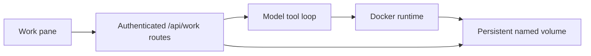

# Work Workspaces

Work is Libre WebUI's native local coding surface. Each Work task combines a
durable conversation with its own durable filesystem. A model can inspect and
edit that filesystem, run commands in an isolated container, and start a
preview without receiving general access to the host.

Work is implemented directly in Libre WebUI and uses a native model tool loop
with Ollama and configured plugin-provider adapters. It does not require a
separate agent daemon.

Work is restricted to administrator accounts. It deliberately exposes an
arbitrary-code container runtime, so every administrator with Work access must
be treated as a trusted runtime operator—not merely as a normal chat user.

## How It Works

Libre WebUI owns the task record, messages, tool activity, runtime policy, and
workspace location. The model receives a small set of tools; it never chooses a
host mount, container image, container identifier, or runtime flag.

The container is replaceable. The workspace is not: reopening an older task
loads its existing messages and files even after Libre WebUI or the task
container has restarted.

## Requirements

- A model provider with tool calling: an installed Ollama model, an Ollama
  Cloud model, or an active completion plugin with credentials configured for
  the current administrator. Plugin-backed models must implement the standard
  tool-calling API for their provider.
- Docker installed on the machine that runs the Libre WebUI backend.
- Permission for that backend process to invoke the configured runtime.
- Enough disk space for generated projects and their local dependencies.
- An authenticated Libre WebUI administrator account.

Choose a model that supports tool calls. Libre WebUI inspects Ollama model
capabilities before a run. Configured plugin providers are allowed through the
same OpenAI-compatible, Anthropic, or Gemini tool-call adapters used by Work;
if the remote model rejects tools, the run fails without falling back to a
different provider.

## Runtime Configuration

Work runtime settings are read by the backend:

| Variable                  | Default                                                                                       | Purpose                                         |
| ------------------------- | --------------------------------------------------------------------------------------------- | ----------------------------------------------- |
| `WORK_RUNTIME_IMAGE`      | `node:22.22-bookworm@sha256:2d178f2785b96dfbf62a416ca2e40f50e30150b4ff3320d706f0d96e90600eb3` | Image used for task commands                    |
| `WORK_DOCKER_COMMAND`     | `docker`                                                                                      | Docker CLI executable                           |
| `WORK_COMMAND_TIMEOUT_MS` | `120000`                                                                                      | Maximum duration of one command                 |
| `WORK_MAX_OUTPUT_CHARS`   | `50000`                                                                                       | Maximum captured characters per command         |
| `WORK_MAX_AGENT_ROUNDS`   | `48`                                                                                          | Maximum model/tool iterations in one run        |
| `WORK_MEMORY_LIMIT`       | `2g`                                                                                          | Per-container memory limit                      |
| `WORK_CPU_LIMIT`          | `2`                                                                                           | Per-container CPU limit                         |
| `WORK_PIDS_LIMIT`         | `256`                                                                                         | Per-container process limit                     |
| `WORK_PREVIEW_PORT`       | `4173`                                                                                        | Container port used by the task preview process |
| `WORK_MAX_ACTIVE_RUNTIMES_GLOBAL`   | `2`                                                                                | Concurrent container-backed tasks per instance  |
| `WORK_MAX_ACTIVE_RUNTIMES_PER_USER` | `1`                                                                                | Concurrent container-backed tasks per admin     |
| `WORK_MAX_TASKS_GLOBAL`              | `500`                                                                              | Persisted task limit per instance                |
| `WORK_MAX_TASKS_PER_USER`            | `100`                                                                              | Persisted task limit per admin                   |

Runtime status is shown in the Work pane. Libre WebUI does not silently fall
back to running model commands on the host.

Run, preview, file-helper, command, and container-recreation paths all acquire
the same in-process runtime capacity lease. Database admission checks reject
excess run/preview requests before they start, while the runtime lease also
covers short-lived helper requests that do not have a durable run row. A task
with nested operations counts once. Limits return HTTP 429 and can be raised
explicitly for a larger Docker host.

Plugin-backed runs are additionally capped at 12 model/tool rounds, 64 total
tool calls, and at most 4,096 requested output tokens per model response.
Ollama runs allow at most 128 total tool calls. A single autonomous run can
therefore make multiple provider calls and may incur charges; review the
selected provider's pricing and usage controls before starting it.

Use a fixed image version or digest in production. A mutable `latest` image can
change the available tools and the security boundary without changing Libre
WebUI itself.

On backend startup, every known Work container is stopped before Work accepts
new operations. Any failed whole-container teardown—during startup, preview
failure, cancellation, demotion, or ordinary run cleanup—remains fail-closed
and retries every 10 seconds. This prevents a command or network-enabled
preview kept alive by the Docker daemon from becoming invisible after its
database or UI state becomes terminal.

## Network Access

New tasks start with container networking disabled. This is enough for projects
that use tools already present in the Work image, but package downloads,
external APIs, and remote Git operations require network access.

The toggle controls network access for the task container only. It does not
control model traffic sent by the Libre WebUI backend. Model requests go to the
operator-configured Ollama endpoint, Ollama Cloud, or the exact plugin endpoint
persisted with the task and run. Model names never decide the provider route:
this prevents a plugin model from intercepting an identically named Ollama
model.

When a remote model is selected, its provider receives the Work system prompt,
conversation history, tool definitions, and tool results. Tool results can
contain source files, command output, directory listings, or other workspace
data the model requested. The named volume and provider credentials remain on
the backend host; credentials are never mounted into the task container.
Operators must review the provider's retention and training policies before
using Work with sensitive projects.

Enabling the task's network toggle is a security decision. Code running in the
container can then send prompts, generated files, source code, and tool output
to external services. Disable networking again when it is no longer needed.
Network access does not add credentials: Libre WebUI does not mount SSH keys,
cloud credentials, browser profiles, or the Docker socket into task
containers.

The current network-enabled mode provides unrestricted Docker bridge egress. It
does not provide an outbound firewall: generated code may be able to reach
other containers on that bridge, services on the Docker host or local network,
and cloud-instance metadata endpoints. Use Work only for trusted administrators
on a host and network where that access is acceptable.

## Persistence And Isolation

Each task receives an opaque server-generated identifier and a dedicated Docker
named volume. The volume name is derived on the backend and is never accepted
from a browser request. Every Work API operation also verifies the authenticated
task owner.

Only the task workspace is writable and persistent. The remainder of the
container is disposable. Two tasks can contain files with the same names
without sharing their contents, command history, preview process, or model
conversation.

Deleting a task is destructive because it removes the durable workspace.
Review the confirmation in the UI before proceeding. Stopping a preview or
cancelling a run does not delete task files.

## Container Security Boundary

The default runtime policy:

- runs as a non-root user;
- mounts only the selected task workspace at `/workspace`;
- uses a read-only container root filesystem plus bounded temporary storage;
- drops Linux capabilities and enables `no-new-privileges`;
- applies CPU, memory, process, command-time, and output limits;
- disables networking unless it was enabled for that task;
- never mounts the host home directory, repository root, devices, credentials,
  or container-runtime socket.

Tool arguments are still validated by Libre WebUI. Container isolation is not
used as a substitute for authorization, path containment, resource limits, or
command cancellation.

A Work volume does not currently have an independent disk quota. A generated
project or package install can exhaust space allocated to Docker volumes.
Monitor Docker storage, enforce host-level storage limits where available, and
do not expose Work to untrusted users.

A container is not a virtual machine. It shares the runtime host's kernel, and a
runtime or kernel vulnerability can cross this boundary. Do not present Work as
a safe place to execute deliberately malicious code on a sensitive host.

## Preview Security

Generated applications are untrusted code. For a network-enabled task, Libre
WebUI publishes the configured preview port to a dynamically assigned loopback
port. The preview therefore has a different origin from Libre WebUI and does not
receive the WebUI's authentication credentials. The model and browser cannot
choose an arbitrary host port.

Preview is unavailable while task networking is disabled.

To permit these embedded loopback frames, the current WebUI response policy
allows loopback frame sources and does not enable cross-origin embedder policy
or automatic HTTP-to-HTTPS request upgrades. Those response-header choices
apply to the full WebUI origin, not only the Work pane. Operators who require
stricter cross-origin isolation should disable or remove embedded previews and
restore those headers.

The embedded preview is a local-machine feature: the browser and Libre WebUI
backend must run on the same host because the preview URL uses a dynamically
assigned loopback port. A browser connecting to Libre WebUI from another
machine cannot reach that backend loopback address. HTTPS deployments may also
block a plain-HTTP local preview under browser mixed-content rules.

Do not copy secrets into a generated application. Browser code with task
network access can transmit any data that application can read.

## Docker, The Docker Image, And Helm

The normal Libre WebUI Docker image does not include the Docker CLI and does not
receive the host Docker socket. Therefore Work reports the runtime as
unavailable in the standard Compose and Helm deployments.

Mounting `/var/run/docker.sock` into a web application container gives that
application root-equivalent control of the Docker host. Libre WebUI does not
enable this configuration by default. Operators who deliberately provide a
runtime are responsible for protecting access to the Docker daemon and for
backing up the Docker volumes that contain Work task data.

Kubernetes does not expose Docker inside a pod. Supporting Work there requires a
separate Kubernetes runtime driver, tightly scoped RBAC, per-task pods, and
persistent volumes. The current Helm chart does not create those resources.

## Troubleshooting

### Runtime unavailable

Confirm Docker is installed on the backend machine and that the backend user can
run the configured `WORK_DOCKER_COMMAND`. If Libre WebUI itself runs in Docker or
Kubernetes, read the deployment limitations above.

### A run says the model lacks tools

Inspect the model in Ollama and confirm its capabilities include `tools`. Pull a
tool-capable model or choose one of the compatible installed models.

### Package installation fails

The task probably has networking disabled. Enable network access only if the
project and dependencies are trusted. A change applies to subsequent commands
and previews; it does not alter a command that is already running.

### Files are present but the preview stopped

Preview processes are ephemeral. Reopen the task and start its preview again;
the persistent workspace remains unchanged.
