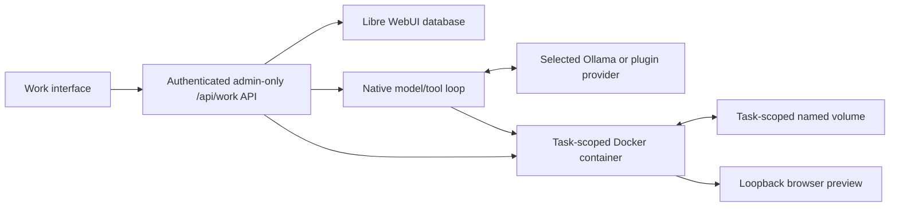

# Work: Isolated Workspaces

Work is Libre WebUI's native coding-agent surface. Each Work task combines a
durable conversation, an explicit model-provider route, and a dedicated
filesystem at `/workspace`. The selected model can inspect and edit files, run
commands in a task-scoped Docker container, and start a browser preview.

Work is implemented directly in Libre WebUI. It does not require Libre Claw or
another agent daemon.

:::warning Trusted administrators only

Every Work API requires an authenticated administrator account. Work
deliberately lets a model execute arbitrary shell commands inside a container,
and current UI-created Work containers have network egress. Treat every
administrator with Work access as a trusted runtime operator, not merely as a
chat user.

:::

## Release Highlights

This release introduces Work as a complete task workflow:

- Separate **Work** and **Chat** actions in the main sidebar, with the active
  mode visibly selected.
- Work tasks in the normal sidebar instead of a second task rail. Existing
  task positions remain stable while runs update, and the selected task can be
  deleted directly.
- A dedicated Docker container identity and persistent named volume for every
  task. Containers can be stopped or recreated without deleting task files.
- Durable conversation, run state, tool activity, model selection, and task
  ownership in Libre WebUI's database.
- A live, authenticated run stream for assistant text, provider-exposed
  reasoning, tool calls and results, usage, worker skills, and state changes.
- Server-owned worker skills that teach the selected model how to inspect,
  edit, verify, and preview efficiently without writing control files into the
  project.
- Tool-capable local Ollama models, Ollama Cloud models, and configured
  completion or chat provider plugins.
- A responsive Conversation/Workspace split with draggable, keyboard
  accessible sizing on desktop and a focused surface switcher on smaller
  screens.
- Integrated Files, Activity, Git, Terminal, and Preview views.
- Dark- and light-mode syntax highlighting, browser-side code formatting,
  save conflict detection, and temporary unsaved drafts.
- A dismissible, per-user disclosure when a remote model provider is selected.
- Complete Work translations across all 25 supported locales, including
  native Arabic right-to-left layout while code, paths, model identifiers, and
  command output remain left-to-right.

The persistent unit is the task workspace, not a continuously running
container. Libre WebUI starts, stops, and may recreate the task's container as
needed while retaining its named volume.

## Architecture



Libre WebUI, rather than the model or browser, chooses the container name,
volume name, image, mount, user, limits, network mode, and preview port. The
model receives only these tools:

- `list_files`
- `read_file`
- `write_file`
- `delete_file`
- `move_file`
- `search_files`
- `run_command`
- `start_preview`
- `stop_preview`

`delete_file` and `move_file` are path-guarded like the other file tools:
they refuse to leave the workspace, never traverse symlinks, require an
explicit recursive flag before removing a directory, and never overwrite a
move destination. Because they run through the file-helper path rather than a
shell, they also work while a preview is running, when `run_command` is
blocked.

Model requests are made by the Libre WebUI backend. They do not originate from
the Work container and do not depend on the container's network policy.

## Requirements

Work needs all of the following on the machine running the Libre WebUI backend:

- Docker installed, with a reachable daemon.
- Permission for the backend process to invoke `docker`, or the executable
  configured through `WORK_DOCKER_COMMAND`.
- A tool-capable model exposed through:
  - a healthy Ollama service, including models reached through Ollama Cloud; or
  - an active completion/chat plugin with an exact configured model and
    credentials for the current administrator.
- Enough Docker storage for the runtime image, generated projects, and
  project-local dependencies.
- An authenticated administrator account.

Libre WebUI checks Ollama's advertised model capabilities before creating a
run and rejects an Ollama model that does not advertise `tools`. Plugin-backed
models must support their provider's tool-calling protocol. If a selected
remote model rejects tools, the run fails; Work does not silently switch to a
different model or provider.

## Start Locally

For the simplest supported Work setup, run Libre WebUI and Docker on the same
computer as the browser:

```bash
docker info
npx libre-webui
```

Open `http://localhost:8080`, sign in as an administrator, select **Work** in
the sidebar, choose a compatible model, and describe the project or change.

If Docker is missing, stopped, or inaccessible, Work shows **Runtime
unavailable** with the backend's reason and disables the Run composer. Libre
WebUI never falls back to executing Work commands directly on the host.

The runtime image is inspected on first use and pulled automatically when it
is absent. The first operation can therefore take longer than later ones.

## Using the Work Interface

### Create and revisit tasks

Select **Work** beside **Chat** in the sidebar. Enter an instruction, choose a
model, and select **Run**. The first message creates the task, its first run,
its provider route, and its persistent workspace.

Each task remains in the primary sidebar. Reopening it restores its recent
conversation, Files view, current provider/model selection, and workspace.
Older conversation messages can be loaded in pages. You can rename the task
from its title and permanently delete it from either the selected-task menu or
the sidebar.

Only one run can be active for a task. A later instruction creates another run
against the same conversation and filesystem.

### Understand task status

The interface maps durable backend states to a smaller user-facing set:

| Interface status | Backend state                | Indicator color      |
| ---------------- | ---------------------------- | -------------------- |
| Idle             | `idle`                       | `rgb(255, 255, 255)` |
| Thinking         | `preparing` or `running`     | `rgb(48, 121, 255)`  |
| Complete         | `completed`                  | `rgb(76, 212, 117)`  |
| Needs input      | `needs_input` or `cancelled` | `rgb(255, 204, 0)`   |
| Error            | `failed`                     | `rgb(255, 61, 129)`  |

Stopping an active run changes it to **Needs input** and preserves its files.
Exhausting the round or tool-call safety budget also ends in **Needs input**
after the final no-tools handoff, so incomplete work is never labeled
**Complete**.

### Resize the workspace

At the `xl` desktop breakpoint, Conversation and Workspace share a draggable
split:

- The default conversation width is 45%.
- The preferred range is 30% to 70%, subject to minimum content widths.
- The saved ratio is scoped to the signed-in user in that browser.
- Arrow keys move the separator by 2%; hold Shift for 10%.
- Home and End select the available minimum and maximum.
- Enter or double-click resets the split.

The controls follow the active writing direction. In Arabic, Conversation is
on the right, Workspace is on the left, and pointer and arrow-key resizing
continue to operate in the expected visual direction.

On smaller screens, use the Conversation/Workspace control in the task header
to switch surfaces.

### Files

The Files tab browses direct children of `/workspace`, opens strictly valid
UTF-8 text files, and saves changes back to the task volume. Invalid byte
sequences are rejected instead of being replaced with lossy placeholder
characters.

The editor provides:

- syntax highlighting in both light and dark modes for common web, systems,
  scripting, data, and markup languages;
- `Cmd/Ctrl+S` to save;
- `Shift+Alt+F` to format supported files;
- optimistic save conflict detection, so an older editor view cannot silently
  overwrite a file changed since it was opened;
- task-and-path-scoped unsaved drafts in browser session storage; and
- navigation warnings while an unsaved edit is open.

Live highlighting pauses above 8,000 characters or 400 lines to keep editing
responsive. Formatting is available up to 100,000 characters and 4,000 lines
for JavaScript/JSX, TypeScript/TSX, JSON variants, CSS/SCSS/Less, HTML,
Markdown/MDX, and YAML.

When the model changes a file you had open, the Files tab opens a red/green
Changes view showing exactly what was added and removed since the turn
started, with long unchanged runs folded away. A toolbar toggle switches
between the diff and the editor, and the `+added −removed` counters summarize
the turn at a glance. The comparison baseline is the last content your browser
saw before the turn, so files first opened after the turn show no diff.

Browser drafts are convenience state, not a backup. They are cleared after a
successful save or task deletion and normally disappear when the browser
session ends.

### Activity

The Activity tab shows tool calls, tool results, file operations, command
output, and errors. Tool metadata can be expanded in the conversation. Command
and tool output is displayed left-to-right even when the surrounding
interface is right-to-left.

While a run is active, Libre WebUI opens an authenticated server-sent event
stream and renders progress as the backend receives it. The stream can carry:

- an initial `snapshot` and later `run_state` changes;
- `reasoning_delta` when the selected provider explicitly exposes reasoning;
- `assistant_delta` text;
- `tool_call` and `tool_result` activity;
- `usage` measurements;
- `skill_loaded` notifications for server-supplied worker guidance; and
- terminal `error` or `done` events.

Reasoning availability and granularity depend on the model and provider.
Libre WebUI displays only reasoning content the provider returns through its
API; it cannot recover hidden chain-of-thought, and some models provide no
reasoning stream at all. Assistant text and tool activity still stream when
supported independently of reasoning.

Output is deliberately bounded. A truncated result is not proof that a command
produced no additional output; ask the model to inspect a narrower result or
run a more focused command.

### Git

The Git tab provides local source-control operations for the task's own
`/workspace`:

- initialize a repository with a `main` branch;
- inspect porcelain status, ahead/behind counts, and up to 20 recent commits;
- inspect a bounded textual diff for a changed path;
- stage up to 200 explicitly selected paths at a time;
- commit staged changes using the signed-in administrator's username and
  email, or an instance-local no-reply address when the account has no email;
- create a local branch after the first commit; and
- switch to an existing local branch when the worktree is clean.

This surface is intentionally **local-only**. It has no clone, fetch, pull,
push, remote-management, arbitrary Git-command, token, SSH-key, or pull-request
control. Those operations need a separate trusted credential broker, ideally a
GitHub App or equivalent installation token scoped to one repository and one
operation. Do not put long-lived Git credentials in `/workspace`, the task
container environment, or repository configuration.

Git reads can run while the task is otherwise idle or active. Git writes are
rejected while a model run, interactive terminal, or preview owns the task
container. Branch switching additionally requires a clean worktree. This
prevents the UI from racing the model or a long-lived process over the same
files.

Every UI Git command is a fixed argument array executed as UID/GID `1000:1000`
inside the task container; user input is never evaluated by a shell. The
runtime disables system/global Git configuration, prompts, hooks, credential
helpers, commit signing, submodule recursion, external diff drivers, textconv,
and network protocols for this surface. It refuses repositories whose
worktree is not exactly `/workspace` or whose Git/common directory resolves
outside `/workspace`. Git write actions that could process file content are
also blocked when repository configuration defines an executable clean,
smudge, or process filter.

These controls protect the Libre WebUI Git API. An administrator can still use
the Terminal, and the model can still use `run_command`, to run ordinary Git
commands inside the sandbox. The sandbox and deployment boundary therefore
remain the security controls for arbitrary commands.

### Built-in worker skills

Every run receives a server-owned workspace guide. It explains the durable
`/workspace` boundary, read-only container root, temporary process and `/tmp`
state, network policy, command and output limits, and preview lifecycle. Its
built-in skills direct the model to:

- inspect project instructions, manifests, lockfiles, scripts, and current
  repository state before editing;
- preserve unrelated work and batch independent reads or searches;
- continue through implementation instead of stopping after a plan;
- run focused verification before broader checks;
- diagnose a failure instead of blindly retrying it; and
- verify the application before starting the preview as the final long-lived
  process.

The guide exists in model context only. Libre WebUI does not create an
`AGENTS.md`, skill directory, or other control file in the user's workspace.
Project-provided instructions remain project guidance and cannot override the
container or tool security boundary.

### Terminal

The Terminal tab attaches an interactive shell to the same sandboxed container
the model works in, so an administrator can inspect state, run a build by
hand, or debug what a run left behind without leaving the browser.

The shell runs under the identical container policy as every model tool: the
unprivileged `1000:1000` user, working directory `/workspace`, inside the
already-hardened, capability-dropped container. A terminal grants no privilege
the model's `run_command` tool does not already have — it is a human-facing
interface to the same boundary, not a way around it.

Operational behavior:

- **Authentication** — the WebSocket at `/ws/work-terminal` requires a valid
  token and re-checks the administrator role against the database on every
  connection, so a demotion takes effect immediately. The task must belong to
  the authenticated administrator.
- **Admission** — an open terminal takes a runtime lease exactly like a
  command or preview, and counts against `WORK_MAX_ACTIVE_RUNTIMES_*`.
- **Container lifetime** — an attached terminal keeps the container running
  and prevents the idle-stop path from removing it mid-session.
- **Concurrency** — `WORK_TERMINAL_MAX_SESSIONS_PER_TASK` (default 2) bounds
  simultaneous shells per task.
- **Idle timeout** — `WORK_TERMINAL_IDLE_TIMEOUT_MS` (default 15 minutes)
  closes an untouched session and releases its lease.
- **While a run is active** — the tab explains that the model owns the
  container and opens the shell once the turn finishes.

The terminal needs the Docker Engine **Unix socket**, because a TTY session
requires a hijacked bidirectional stream that the Docker CLI only provides to
a real controlling terminal. It uses `WORK_DOCKER_SOCKET`, otherwise a
`unix://` `DOCKER_HOST`, otherwise `/var/run/docker.sock`. A deployment whose
`DOCKER_HOST` is a remote TCP endpoint reports the terminal as unavailable
with that reason rather than silently attaching elsewhere; the rest of Work
keeps working.

Terminal sessions are interactive, not recorded. Commands typed there do not
appear in the task's Activity timeline.

### Preview

The Preview tab starts, stops, embeds, and opens the generated web application.
When the command field is empty, Libre WebUI inspects the workspace and:

- runs a root `package.json` `dev` script with the required host and port;
- serves a root `index.html` with a bundled, zero-dependency static server; or
- uses the same rules for a single app in a nested directory.

Root applications take precedence. If multiple equally likely nested apps are
found, or no supported entry point exists, Work returns an actionable error
instead of attempting an unrelated npm command. Enter a custom command before
selecting **Start preview** for other project layouts or servers. Custom
commands start in `/workspace`, so include the relative directory when needed,
for example `cd apps/web && npm run dev -- --host 0.0.0.0 --port 4173`. A
custom process must listen on `0.0.0.0` and the configured
`WORK_PREVIEW_PORT`. Work waits up to 15 seconds for the port to become ready.

The model can also start the preview through its `start_preview` tool. This is
the only supported way for a model to leave a process running. Ordinary
`run_command` calls clean up background descendants when the command finishes.

## Providers, Routing, and Data Disclosure

### Supported provider routes

| Route                    | Validation and behavior                                                                           |
| ------------------------ | ------------------------------------------------------------------------------------------------- |
| Local Ollama             | Ollama must be healthy and the exact model must advertise tool support.                           |
| Ollama Cloud             | Routed explicitly through Ollama; cloud-suffixed models display the remote-provider disclosure.   |
| Completion/chat plugin   | Plugin must be active, list the exact model, and have a credential for the current administrator. |
| Anthropic plugin         | Uses Work's Anthropic messages and tool-use adapter.                                              |
| Gemini plugin            | Uses Work's Gemini contents and function-calling adapter.                                         |
| Other compatible plugins | Use the OpenAI-style messages, tools, and tool-choice request shape.                              |

Provider type and plugin ID are stored on both the task and each run. A model
name never chooses the route by itself. Activating a plugin with the same model
name as an Ollama model cannot intercept an existing task.

### What a provider receives

For each model round, the selected provider can receive:

- the Work system prompt;
- the built-in worker skills and current runtime limits;
- up to the most recent 30 user/assistant conversation messages, bounded to
  256 KB;
- Work tool definitions;
- assistant tool-call history; and
- tool results, which can include directory listings, requested file contents,
  search results, command output, and errors.

The named volume is not uploaded wholesale. However, any file content or
command output returned through a tool becomes part of the model conversation
and is sent to the selected provider. Review remote providers' retention,
training, pricing, and usage policies before using sensitive source code.

Provider credentials remain on the Libre WebUI backend, whether they are
configured deployment-wide or for an individual user. They are used for
backend model requests and are never mounted into the Work container.

Application-layer credential encryption is not whole-task encryption. Work
conversations, tool results, command output, and task metadata are ordinary
database content, while workspace files and dependencies are ordinary files in
the task's Docker volume. Use host access controls and disk encryption when the
deployment's threat model requires encryption at rest.

### Remote-provider disclosure

Work treats plugin models and Ollama names ending in `:cloud` or `-cloud` as
remote for disclosure purposes. Selecting one opens a dismissible notice that
explains provider data flow and the possibility of multiple billable calls.
The dismissal preference is remembered per Libre WebUI user.

All provider routes use the same `WORK_MAX_AGENT_ROUNDS` budget, 48 rounds by
default. There is no separate 12-round plugin clamp. The tool-call safety
budget is the larger of 128 calls or eight calls per configured round. When the
round budget is exhausted, Libre WebUI asks the model for one final no-tools
handoff describing completed work, checks, blockers, and remaining steps. It
then records the terminal run as **Needs input** instead of exposing a raw
round-limit exception or marking incomplete work complete. A follow-up run
continues in the same durable workspace. A single Work run can still make many
billable provider requests.

## Host Folder Workspaces (Opt-In)

By default a task's `/workspace` is a Docker named volume that exists only for
that task, so the model can never reach your real files. A deployment can
instead allow a task to be bound to an actual folder on the host.

Set both variables, then restart the backend:

```bash
WORK_HOST_WORKSPACES_ENABLED=true
WORK_HOST_WORKSPACE_ROOTS=/Users/you/Projects
```

`WORK_HOST_WORKSPACE_ROOTS` is a `:`-separated list of roots; it defaults to the
server user's home directory. When the feature is on, the Work landing screen
gains an optional **Workspace folder** field. Leave it blank and the task
behaves exactly as before, with its own isolated volume.

Before a path is accepted it must be absolute, exist, be a directory, and
resolve — through any symlinks — to a location inside one of the configured
roots. Directories named `.ssh`, `.gnupg`, `.aws`, `.config`, `.kube`,
`.docker`, `.claude`, `.libre-webui`, or `node_modules` are refused outright.
The resolved path is stored with the task and shown in the task header, so it is
always visible which folder a task is operating on.

:::caution This narrows the sandbox

A host workspace means the model reads and writes your real files, and the
container's other protections — non-root user, dropped capabilities, resource
limits — no longer stand between it and that directory. Keep the feature
disabled unless you want it, keep the roots as narrow as possible, and prefer
directories that are under version control.

:::

## Persistence and Runtime Lifecycle

Libre WebUI separates durable state from execution state:

| State                                       | Storage                           | Lifetime                                                                   |
| ------------------------------------------- | --------------------------------- | -------------------------------------------------------------------------- |
| Task ownership, title, provider, and status | Libre WebUI database              | Until the task or owning user is deleted                                   |
| Runs, errors, messages, and tool activity   | Libre WebUI database              | Until the task is deleted                                                  |
| Workspace files                             | Task-specific Docker named volume | Survive run cancellation, preview stop, container restart, and app restart |
| Root filesystem and temporary files         | Task-specific Docker container    | Disposable; may be stopped or recreated                                    |
| Preview process                             | Running task container            | Ephemeral; retained only while verified healthy                            |
| Unsaved editor draft                        | Browser session storage           | Temporary browser-session convenience state                                |

Every task gets a server-generated UUID. Its container and volume names are
derived on the backend and are never accepted from a browser request. Libre
WebUI creates both resources with managed and task-ownership labels. Before
reuse or deletion, it verifies the task-ownership label and refuses a resource
whose label belongs to another task.

Containers are prepared on demand. File-helper operations stop an otherwise
idle container, commands stop the container after completion, and a verified
preview may keep it running so the user can inspect the app. The named volume
stays mounted again when the same task container is restarted or recreated.

On backend startup, active runs are marked failed, preview state is cleared,
and Libre WebUI attempts to stop every known Work container. If Docker cannot
prove a container was stopped, the cleanup remains tracked, new mutable Work
operations stay blocked, and Libre WebUI retries every 10 seconds. An old
command or preview may still be running while Docker is unavailable, so restore
daemon access and let recovery complete before treating the runtime as stopped.

## Network Behavior

:::caution Work is not offline

Current UI-created Work tasks use Docker bridge networking from creation.
Existing tasks are migrated to the same network-enabled state. There is no
network on/off control in the Work interface.

:::

Networked tasks attach to a dedicated managed Docker bridge network
(`libre-webui-work` by default, `WORK_NETWORK_NAME`) created with
inter-container communication disabled
(`com.docker.network.bridge.enable_icc=false`). Two consequences follow:

- one Work sandbox cannot open connections to another Work sandbox; and
- a Work sandbox cannot reach the deployment's own containers on Docker's
  shared default bridge, including a co-located database or Ollama container
  that is not deliberately published.

Libre WebUI refuses to start a networked task if a network with the configured
name already exists but is not the managed one, rather than silently attaching
sandboxes to an operator's network.

Egress to the outside world is still permitted, because package downloads,
remote Git operations, and external APIs are what makes Work useful. This is
not an outbound firewall. Generated code may still be able to reach:

- services on the Docker host;
- systems on the host's local network;
- internet services; and
- infrastructure metadata endpoints, depending on the deployment.

### Egress policy hooks

For a stricter boundary, use these in combination:

- **`WORK_RUNTIME_DNS`** — comma-separated IPv4/IPv6 resolver addresses forced
  onto every networked sandbox (`--dns`). Pointing this at a filtering
  resolver gives you name-based allow/deny lists without patching Libre WebUI.
  Non-address entries are rejected and logged, so the value can never inject
  additional Docker flags.
- **Host or upstream firewall rules** on the managed bridge's subnet, which is
  stable because the network is named and managed.
- **`WORK_NETWORK_NAME`** pointed at a network you pre-create yourself with
  your own driver options — Libre WebUI verifies it carries the managed label
  and ICC-disabled option, so create it with both.

DNS filtering constrains name resolution, not raw IP egress. A deployment that
must guarantee no direct-IP egress needs host-level firewall rules as well.

Do not assume that placing code in Work prevents it from transmitting data.
Use Work only for trusted administrators. There is no Work environment
variable that changes the UI-created task default to offline mode.

Network access does not add credentials. Libre WebUI does not mount SSH keys,
cloud credentials, browser profiles, the host home directory, or the Docker
socket into task containers. Code can still transmit any credentials or
secrets that a user or model writes into `/workspace`.

This container traffic is separate from model traffic. Ollama and plugin
requests are always sent by the Libre WebUI backend to the explicitly selected
provider route.

## Container Security Boundary

A current UI-created Work container:

- runs as non-root UID/GID `1000:1000`;
- uses `/workspace` as its working directory;
- mounts only the selected task's named volume at `/workspace`;
- uses a read-only root filesystem and a bounded `/tmp` temporary filesystem;
- drops all Linux capabilities;
- enables `no-new-privileges`;
- is non-privileged and uses an init process;
- applies CPU, memory, process, command-time, and output limits;
- pins swap to the memory limit (`--memory-swap` equals `--memory`), so the
  memory cap cannot be sidestepped by swapping;
- attaches to the managed sandbox network with inter-container communication
  disabled, or to no network at all; and
- publishes only the configured preview port to a Docker-assigned loopback
  host port.

Every one of these is re-verified against `docker inspect` before a container
is reused, and the whole set is hashed into the `ai.libre-webui.policy`
container label. A container whose policy predates a Libre WebUI upgrade is
destroyed and recreated rather than reused, so a hardening change reaches
existing tasks automatically.

Path validation rejects absolute paths, traversal segments, backslashes, NUL
characters, and overlong paths. File helpers resolve real paths and reject
symlink escapes. Writes use a temporary file and atomic rename.

These controls reduce accidental host exposure; they do not make Work a
virtual machine or a safe malware-analysis environment. Containers share the
Docker host's kernel. A Docker, runtime, image, dependency, or kernel
vulnerability can cross the intended boundary.

Work volumes do not have an independent disk quota. A generated project or
package installation can exhaust Docker storage. Monitor volume growth and
apply host-level storage limits where needed.

## Production Hardening Checklist

The application can set container flags, validate workspace paths, and guard
its own API. It cannot enforce host firewall policy, storage-driver quotas, or
the privilege level of the Docker daemon it is given. Treat these as explicit
deployment work for a private client instance.

### 1. Isolate Docker control

The main Libre WebUI container needs daemon control to create and inspect Work
containers. A mounted Docker socket is therefore a control-plane credential,
not an ordinary data mount: compromising the web application can become a
Docker-host compromise.

For a stronger production boundary, run Libre WebUI and its Work daemon on a
dedicated VM with no unrelated workloads. Stronger still, give Work a
dedicated rootless Docker daemon or a separate runtime host and expose only
that daemon to Libre WebUI. Verify file ownership, preview routing, cleanup,
and terminal support against that daemon before rollout. Merely mounting the
same rootful host socket read-only does not make the Docker API read-only.

### 2. Block sandbox-to-host management access

Disabling inter-container communication prevents Work sandboxes from reaching
one another; it does not prevent them from reaching services bound on the
Docker host. Inspect the actual managed bridge and subnet rather than assuming
an address:

```bash
docker network inspect libre-webui-work \
  --format 'id={{.Id}} subnets={{range .IPAM.Config}}{{.Subnet}} {{end}}'
ss -lntup
```

Use the host's persistent firewall manager to reject traffic arriving from
that bridge to host management services, especially SSH, the Docker API,
databases, and monitoring/admin ports. Test the rule from a disposable
container attached to `libre-webui-work`, test allowed package downloads, then
make the rule persistent. Docker's `DOCKER-USER` chain controls forwarded
traffic; traffic whose destination is the Docker host itself may need an
`INPUT`/input-hook rule on the bridge interface as well.

### 3. Constrain outbound destinations

Block cloud metadata endpoints, private infrastructure ranges, and client LAN
ranges from the Work subnet unless a project explicitly needs them. Combine a
filtering resolver through `WORK_RUNTIME_DNS` with host or upstream firewall
rules. DNS filtering alone is bypassable with a literal IP address. An HTTP
proxy alone is also insufficient while arbitrary commands can open direct
network connections; enforce the routing policy outside the container.

Maintain separate profiles when clients need different behavior, for example
an offline/no-network runtime, a package-registry-only runtime, and an open
egress runtime. Libre WebUI currently creates networked UI tasks, so those
profiles require operator-owned network policy rather than a cosmetic UI
toggle.

### 4. Enforce real storage quotas

CPU, memory, swap, and PID limits do not limit the named volume. Before serving
multiple clients, choose a storage backend with enforceable per-workspace
quotas: for example XFS project quotas, quota-backed logical volumes, or a
volume/PVC driver with a size limit. The default Docker `local` driver on an
ordinary ext4 filesystem does not gain a reliable per-volume quota merely by
documenting a size value.

Monitor both each `ai.libre-webui.managed=true` volume and the Docker data root,
alert before the filesystem is full, and test the failure mode. A UI counter or
periodic `du` check can warn, but it is not an enforcement boundary because a
container can consume the remaining disk between checks.

### 5. Verify the deployed policy

After every image or daemon-policy change, create a disposable Work task and
verify the effective state with `docker inspect`: non-root UID, read-only root,
all capabilities dropped, `no-new-privileges`, memory/swap/CPU/PID limits,
only the task volume mounted, and the expected network. Also verify that the
main Libre WebUI container has only the intended mounts and that public ingress
reaches the app through the authenticated reverse proxy or tunnel—not through
an accidentally published Docker or preview port.

## Preview Security and Reachability

For each task, Docker publishes the configured container preview port to a
dynamically assigned port on `127.0.0.1`. The model and browser cannot choose
an arbitrary host port. Libre WebUI signs a capability URL for that exact task
and port, verifies that the preview is still running on every request, and
proxies HTTP and WebSocket traffic through `/api/work/previews`. Stopping or
restarting the preview revokes the old URL.

Preview responses strip Libre WebUI credentials and upstream cookies. HTML is
constrained by both an iframe sandbox and response CSP that allow scripts,
forms, modals, and downloads without granting same-origin access. The CSP also
protects a preview opened in a separate tab. Generated application code
remains untrusted and can use network egress to transmit anything it can read
from its own workspace or browser inputs. Treat a running preview URL as a
short-lived secret and do not share it.

Because the browser loads the proxy on Libre WebUI's own public origin, remote
browsers and HTTPS reverse proxies work without exposing dynamic Docker ports
or triggering mixed-content blocking. Reverse proxies must preserve WebSocket
upgrades for `/api/work/previews/`; the provided Nginx configuration does so.

The main application permits only its own origin and Cloudflare Turnstile as
frame sources. Preview responses bypass the main Helmet policy so they can
stream request bodies and apply the narrower sandbox policy described above.
Cross-origin embedder policy remains disabled because generated dev servers do
not normally emit compatible resource headers.

## Deployment Matrix

Work availability follows the machine and process running the Libre WebUI
backend, not merely the browser or desktop interface.

| Deployment                                | Work runs and files                                                                                       | Embedded preview                                                              |
| ----------------------------------------- | --------------------------------------------------------------------------------------------------------- | ----------------------------------------------------------------------------- |
| `npx libre-webui` on a local computer     | Supported when Docker is installed, running, and callable by the backend user.                            | Supported through the signed application-origin proxy.                        |
| Source development on a local computer    | Supported under the same Docker and provider requirements.                                                | Supported through the development API origin on port 3001.                    |
| Electron desktop client                   | Conditional. Electron uses an external Libre WebUI backend and does not provide a separate Work runtime.  | Supported through that backend's signed proxy URL.                            |
| Bare-metal or VM backend on a remote host | Runs, files, and provider calls work when Docker is available on that host.                               | Supported when the public reverse proxy preserves HTTP and WebSocket traffic. |
| Standard repository Docker Compose        | Supported by default: the image ships the Docker CLI and the Compose file mounts the host Docker socket.  | Supported through the same public Libre WebUI origin.                         |
| Current Kubernetes/Helm deployment        | Unavailable: the chart does not create a Work runtime driver, per-task Pods, RBAC, or persistent volumes. | Unavailable.                                                                  |

### Running Work when Libre WebUI is itself in Docker

Every repository Compose file enables Work: the image ships the Docker CLI and
the Compose file mounts `/var/run/docker.sock`. `docker compose up -d` is all
that is required.

Work drives the host daemon through that socket, so task containers are
**siblings** of the Libre WebUI container rather than children. They appear in
`docker ps` on the host and are cleaned up by the same lifecycle rules as a
native install.

Mounting the Docker socket into a web application gives that container
root-equivalent control over the Docker host. Work cannot function without it,
so Libre WebUI enables it rather than shipping a feature that silently does
nothing. The consequence is explicit: **every Libre WebUI administrator is
effectively an administrator of the Docker host.** Operators own the
daemon-security, network, lifecycle, backup, and access-control consequences.
Delete the `/var/run/docker.sock` line from your Compose file to turn Work off;
nothing else depends on it.

Three conditions must hold, and the Work panel names whichever one fails:

1. **The Docker CLI must exist in the image.** It ships in the official image; a
   custom image needs `docker-cli`, or `WORK_DOCKER_COMMAND` pointing at one.
   Otherwise: `The "docker" CLI is not installed…`.
2. **The socket must be mounted.** Otherwise: `No Docker daemon is reachable…`.
3. **The backend user must be in the socket's group.** The image runs as
   `nodejs` (uid 1001) and the socket is typically owned by `root` or `docker`,
   so Compose passes `group_add: ['${DOCKER_GID:-0}']`. The default suits Docker
   Desktop; a Linux host needs its own group id. Otherwise: `The Docker socket
is mounted but the Libre WebUI user cannot open it…`.

```bash
# Read the socket's group as seen INSIDE a container. A macOS host reports a
# different value, because Docker Desktop proxies the socket through a VM.
echo "DOCKER_GID=$(docker run --rm -v /var/run/docker.sock:/var/run/docker.sock \
  alpine stat -c '%g' /var/run/docker.sock)" >> .env
docker compose up -d --force-recreate
```

Task preview ports remain bound to Docker host loopback. Libre WebUI exposes
each running preview through a signed same-origin proxy URL, including HTTP
assets and WebSocket upgrades. This works behind HTTPS and remote tunnels
without opening the ephemeral Docker ports to the network. Preview documents
receive a restrictive browser sandbox policy, and stopping or restarting a
preview revokes its previous URL.

Concurrency is capped separately: `WORK_MAX_ACTIVE_RUNTIMES_PER_USER` defaults
to `2` and `WORK_MAX_ACTIVE_RUNTIMES_GLOBAL` to `3`, so an administrator can
run a second task while the first is busy. The capabilities response reports
both limits and the live occupancy. Raise them if the host has memory and CPU
to spare.

Kubernetes support would require a separate runtime implementation with
tightly scoped RBAC, a Pod and persistent volume design for each task, cleanup
reconciliation, and a preview-routing design. The current Docker runtime must
not be described as Kubernetes-native.

## Runtime Configuration

Work reads these variables in the backend process:

| Variable                              | Default                                                                                       | Purpose                                                    |
| ------------------------------------- | --------------------------------------------------------------------------------------------- | ---------------------------------------------------------- |
| `WORK_RUNTIME_IMAGE`                  | `node:22.22-bookworm@sha256:2d178f2785b96dfbf62a416ca2e40f50e30150b4ff3320d706f0d96e90600eb3` | Image used for task containers                             |
| `WORK_DOCKER_COMMAND`                 | `docker`                                                                                      | Docker CLI executable                                      |
| `WORK_COMMAND_TIMEOUT_MS`             | `120000`                                                                                      | Default command timeout                                    |
| `WORK_MAX_OUTPUT_CHARS`               | `50000`                                                                                       | Maximum captured command/search output                     |
| `WORK_MAX_AGENT_ROUNDS`               | `48`                                                                                          | Provider-agnostic model/tool round budget per run          |
| `WORK_MEMORY_LIMIT`                   | `2g`                                                                                          | Per-container memory limit                                 |
| `WORK_CPU_LIMIT`                      | `2`                                                                                           | Per-container CPU limit                                    |
| `WORK_PIDS_LIMIT`                     | `256`                                                                                         | Per-container process limit                                |
| `WORK_PREVIEW_PORT`                   | `4173`                                                                                        | Port the app must listen on inside the container           |
| `WORK_PREVIEW_BIND`                   | `127.0.0.1`                                                                                   | Host interface the preview port is published on            |
| `WORK_MAX_ACTIVE_RUNTIMES_GLOBAL`     | `3`                                                                                           | Concurrent container-backed tasks per Libre WebUI instance |
| `WORK_MAX_ACTIVE_RUNTIMES_PER_USER`   | `2`                                                                                           | Concurrent container-backed tasks per administrator        |
| `WORK_MAX_TASKS_GLOBAL`               | `500`                                                                                         | Persisted Work task limit per Libre WebUI instance         |
| `WORK_MAX_TASKS_PER_USER`             | `100`                                                                                         | Persisted Work task limit per administrator                |
| `WORK_NETWORK_NAME`                   | `libre-webui-work`                                                                            | Managed sandbox bridge network for networked tasks         |
| `WORK_RUNTIME_DNS`                    | unset                                                                                         | Comma-separated resolver IPs forced onto networked tasks   |
| `WORK_DOCKER_SOCKET`                  | `DOCKER_HOST` if `unix://`, else `/var/run/docker.sock`                                       | Docker Engine socket used for interactive terminals        |
| `WORK_TERMINAL_MAX_SESSIONS_PER_TASK` | `2`                                                                                           | Simultaneous interactive terminals per task                |
| `WORK_TERMINAL_IDLE_TIMEOUT_MS`       | `900000`                                                                                      | Idle timeout before a terminal session closes              |

Use a fixed image version or digest in production. A mutable image tag can
change both the available command-line tools and the security boundary without
changing Libre WebUI.

Run, preview, file-helper, command, and container-recreation operations share
the same in-process capacity accounting. A nested operation on an already
counted task does not count as another task. Requests over a task or runtime
admission limit return HTTP 429.

### Fixed protocol and UI limits

| Item                                   | Limit                                                       |
| -------------------------------------- | ----------------------------------------------------------- |
| New task or run message                | 65,536 characters and UTF-8 bytes                           |
| Model identifier on task create/update | 500 characters and UTF-8 bytes                              |
| Plugin provider ID                     | 200 characters                                              |
| Active runs per task                   | 1                                                           |
| Command text                           | 20,000 characters                                           |
| Command timeout requested by a tool    | 1 to 600 seconds                                            |
| Preview readiness                      | 15 seconds                                                  |
| File read/write                        | 2,000,000 bytes of UTF-8 text                               |
| Direct directory listing               | First 1,000 entries                                         |
| Message page                           | Up to 200 messages and 1,000,000 bytes                      |
| Persisted individual message           | 100 KB                                                      |
| Conversation context sent to a model   | Last 30 user/assistant messages, up to 256 KB               |
| Persisted tool output                  | About 20,000 source characters plus a marker                |
| Live editor highlighting               | 8,000 characters and 400 lines                              |
| Browser-side formatting                | 100,000 characters and 4,000 lines                          |
| Git status output                      | 2,000,000 captured characters                               |
| Git diff output                        | 600,000 captured characters                                 |
| Git history                            | 20 local commits                                            |
| Paths in one Git stage request         | 200                                                         |
| Git commit message                     | 4,000 characters                                            |
| Agent loop, every provider route       | 48 rounds by default, configured by `WORK_MAX_AGENT_ROUNDS` |
| Tool-call safety budget                | `max(128, configured rounds × 8)` calls                     |

File access is for UTF-8 text. The integrated editor is not a binary-file
editor, and a file larger than 2 MB cannot be opened through the Work file API.

## API Summary

All endpoints are under `/api/work`, require authentication, and require the
current database role to be `admin`.

| Method   | Path                                | Purpose                                        |
| -------- | ----------------------------------- | ---------------------------------------------- |
| `GET`    | `/capabilities`                     | Docker/provider availability and limits        |
| `GET`    | `/tasks`                            | List the current administrator's tasks         |
| `POST`   | `/tasks`                            | Create a task and its first asynchronous run   |
| `GET`    | `/tasks/:id`                        | Load task state and recent messages            |
| `GET`    | `/tasks/:id/messages`               | Page older messages                            |
| `PATCH`  | `/tasks/:id`                        | Rename or change the explicit model route      |
| `DELETE` | `/tasks/:id`                        | Remove the task and durable workspace          |
| `POST`   | `/tasks/:id/runs`                   | Start a follow-up run                          |
| `GET`    | `/tasks/:taskId/runs/:runId/events` | Stream authenticated live run events using SSE |
| `POST`   | `/tasks/:id/cancel`                 | Cancel the active run                          |
| `GET`    | `/tasks/:id/files`                  | List a workspace directory                     |
| `GET`    | `/tasks/:id/file`                   | Read a workspace text file                     |
| `PUT`    | `/tasks/:id/file`                   | Save a workspace text file                     |
| `GET`    | `/tasks/:id/git`                    | Read guarded local Git status and history      |
| `GET`    | `/tasks/:id/git/diff`               | Read a bounded local diff                      |
| `POST`   | `/tasks/:id/git/init`               | Initialize local Git                           |
| `POST`   | `/tasks/:id/git/stage`              | Stage explicit workspace paths                 |
| `POST`   | `/tasks/:id/git/commit`             | Commit staged changes                          |
| `POST`   | `/tasks/:id/git/branches`           | Create a local branch                          |
| `POST`   | `/tasks/:id/git/switch`             | Switch to an existing clean local branch       |
| `POST`   | `/tasks/:id/preview/start`          | Start the managed preview                      |
| `POST`   | `/tasks/:id/preview/stop`           | Stop the managed preview                       |

The task ID is always checked against the authenticated owner. Current-role
authorization is read from the database on each request, so demoting an
administrator takes effect even if an older JWT still says that user was an
administrator.

The task update schema retains a backend `networkEnabled` field for internal
compatibility. It is not exposed as a supported Work UI control, and database
migration restores existing tasks to the current network-enabled behavior. Do
not use that field as a durable offline-mode configuration.

## Deletion, Account Changes, and Backup

### Task deletion

Task deletion is intentionally destructive:

1. The backend marks the task as retiring so no new mutable operation can
   begin.
2. An active run is cancelled and the task container is stopped.
3. Libre WebUI validates the task-ownership labels on both Docker resources.
4. The container and named volume are removed.
5. The database task is deleted, cascading its runs and messages.
6. Browser drafts for that task are cleared after the API succeeds.

If Docker cleanup fails, Libre WebUI retains the task database record and
returns an error so the administrator can repair Docker and retry. It does not
silently delete the metadata while leaving an untracked workspace container or
volume.

Stopping a run or preview is different from deletion: it stops execution but
preserves the named volume and conversation.

### Administrator demotion and user deletion

When an administrator is demoted, Libre WebUI persists the role revocation
before depending on Docker cleanup. Every later Work request checks the current
role. The backend then suspends the user's Work tasks and attempts to abort
active runs and stop their containers. If cleanup fails, Work access remains
revoked and the role update reports the failure so an operator can restore
Docker and retry the same update.

Deleting another user first removes all of that user's managed Work resources.
If external Docker cleanup fails, the user record is retained so an
administrator can retry instead of losing the ownership metadata needed for
safe cleanup.

### Back up the complete task

A complete Work backup needs both:

- the Libre WebUI database, which contains task ownership, Docker resource
  names, provider routing, runs, messages, and activity; and
- every Docker volume labeled `ai.libre-webui.managed=true`, which contains
  the Work files.

The disposable containers and preview processes do not need to be backed up.
For a consistent backup, stop new Work activity and stop the backend before
capturing the database and task volumes. Follow Docker's documented
volume-backup procedure for the storage driver in use.

Restore the database and its matching volumes together. Recreate each volume
under the exact name recorded in the database and restore its task-ownership
metadata, including `ai.libre-webui.task=<task UUID>`; also restore
`ai.libre-webui.managed=true` so operator inventory remains accurate. Copying
only a volume's files does not preserve Docker labels. Restoring only the
database produces task records whose files are absent; restoring only volumes
loses the task ownership and generated resource names that Libre WebUI uses to
find and validate them.

If the installation also uses encrypted provider credentials, follow the main
Libre WebUI backup guidance for its data directory and encryption key.

## Localization and Arabic RTL

The complete Work interface is translated in all 25 supported locales:
English, Arabic, Bengali, Czech, Danish, German, Spanish, French, Hindi,
Indonesian, Icelandic, Italian, Japanese, Korean, Malay, Dutch, Polish,
Portuguese, Russian, Swedish, Thai, Turkish, Ukrainian, Vietnamese, and
Chinese.

Arabic applies `lang="ar"` and `dir="rtl"` before React renders. The sidebar
moves to the right, Conversation occupies the right side of the desktop split,
Workspace occupies the left, directional icons mirror, tab navigation follows
RTL order, and drag/keyboard resizing uses visual RTL semantics.

Technical content remains left-to-right where direction affects correctness:

- code and syntax highlighting;
- filesystem paths;
- model identifiers;
- commands and preview logs;
- tool output and metadata; and
- code-block content.

Task names, natural-language prompts, errors, filenames, and preview commands
use automatic text direction where appropriate.

## Troubleshooting

### Runtime unavailable when using `npx`

`npx libre-webui` runs the backend on the host, but it does not install Docker.
Run `docker info` as the same operating-system user that starts Libre WebUI. If
the command is absent or cannot reach the daemon, install/start Docker or fix
that user's daemon permissions, then reload Work.

Also confirm that either Ollama is healthy or at least one active
completion/chat plugin has a model and credential configured for the current
administrator.

### Runtime unavailable in Docker or Kubernetes

A repository Compose deployment should not report this: the image ships the
Docker CLI and the Compose file mounts the host socket. When it does, the panel
names the cause — a missing CLI in a custom image, a removed or absent socket
mount, or a socket group the container user is not in. For the last one, set
`DOCKER_GID` and recreate the container. See
[Running Work when Libre WebUI is itself in Docker](#running-work-when-libre-webui-is-itself-in-docker).

Kubernetes is different: the Helm chart provides no Work runtime, so
**Runtime unavailable** is expected there. Do not mount a node's
container-runtime socket to clear the status.

### No Work-compatible models

For Ollama, inspect or choose a model that advertises `tools`. For a plugin,
confirm that:

- its type is completion or chat;
- it is active;
- the exact model appears in its configured model map;
- the current administrator has a usable API key; and
- the remote model implements tool calling for that provider.

Work never routes to another provider as a fallback.

### A package install or remote Git command fails

Current UI-created tasks already have bridge egress; there is no Work network
toggle to enable. Inspect DNS, proxy, firewall, registry, certificate, Docker
daemon, and upstream service configuration. Also confirm that the selected
runtime image contains the command being invoked.

The Git tab is local-only and never performs a remote operation. Use the
Terminal or model command surface only when the task's network and credential
policy deliberately permits remote Git. Do not paste a long-lived access token
into a task workspace.

### A run stops at an agent limit

The model may have exhausted the configured round or derived tool-call safety
budget. Work requests a final no-tools handoff before ending the run, so review
its completed work and remaining steps. The task remains in **Needs input**,
which is terminal for that run but deliberately does not claim completion.
Start a follow-up run to continue in the same durable workspace, or
deliberately raise `WORK_MAX_AGENT_ROUNDS` for all providers if the host and
remote-provider cost policy allow longer runs.

### HTTP 429 when starting work

The instance or administrator reached an active-runtime or persisted-task
admission limit. Wait for another run or preview to stop, delete obsolete
tasks, or deliberately raise the corresponding `WORK_MAX_*` setting for a
host with enough resources.

### The preview does not become ready

Confirm that the command remains running, binds to `0.0.0.0`, and listens on
`WORK_PREVIEW_PORT` within 15 seconds. With an empty command, Work automatically
detects a `package.json` `dev` script or a plain `index.html`, including a
single nested app. If the error reports multiple apps or no supported entry
point, enter an explicit command in the optional command field. Custom commands
start in `/workspace`, so use `cd <app-directory> && ...` for a nested app.

### The preview works on the server but not in a remote browser

Confirm that the deployment is running a build with the signed Work preview
proxy, then restart the preview to replace any legacy loopback URL. If ordinary
pages load but hot reload does not, confirm the reverse proxy and tunnel allow
WebSocket upgrades on `/api/work/previews/`. The Docker-published port should
remain on backend loopback and does not need a firewall opening.

### Files remain but the preview stopped

This is expected after cancellation, backend restart, explicit preview stop,
or failed readiness checks. The preview process is ephemeral; the named volume
is durable. Reopen the task and start the preview again.

### A file cannot be opened or saved

The integrated file API accepts UTF-8 text files up to 2 MB. If save reports
that the file changed since it was opened, reload it before editing again so
you do not overwrite another model or browser change.

Syntax highlighting intentionally switches to plain text above 8,000
characters or 400 lines. Formatting has a separate 100,000-character and
4,000-line limit and supports only the documented file families.

### Work says it is recovering containers

Startup or teardown could not prove that one or more known containers stopped.
Work remains fail-closed and retries every 10 seconds. Restore Docker daemon
access and inspect the backend log. Do not delete the task database rows while
their labeled Docker resources still need reconciliation.

### Task deletion fails

Make sure Docker is reachable. A conflicting resource without the expected
`ai.libre-webui.task` label is intentionally rejected rather than removed.
Resolve that name/ownership conflict carefully, then retry deletion.

## Security Summary

Before enabling Work for an installation, remember:

- Work is admin-only but administrators are powerful trusted operators.
- The backend must control a Docker daemon.
- Containers reduce filesystem exposure but are not virtual machines.
- Current UI-created Work tasks have bridge network egress and no UI network
  switch.
- Work volumes have no independent disk quota.
- The Git tab is local-only; remote credentials are never mounted or accepted
  by its API.
- Host firewall policy, daemon isolation, outbound restrictions, and real
  volume quotas remain operator-enforced controls.
- Remote providers receive requested tool results and can incur multiple calls
  per run.
- Preview ports stay on backend loopback and are exposed only through signed,
  revocable proxy URLs.
- Standard Docker Compose and current Kubernetes/Helm deployments do not
  provide the Work runtime.
- A complete backup requires both the Libre WebUI database and Work volumes.

## Related Docs

- [Quick Start](./QUICK_START)
- [Working with Models](./WORKING_WITH_MODELS)
- [Keyboard Shortcuts](./KEYBOARD_SHORTCUTS)
- [Environment Variables](./ENVIRONMENT_VARIABLES)
- [Docker](./DOCKER)
- [Kubernetes](./KUBERNETES)
- [Authentication](./AUTHENTICATION)
- [Troubleshooting](./TROUBLESHOOTING)
