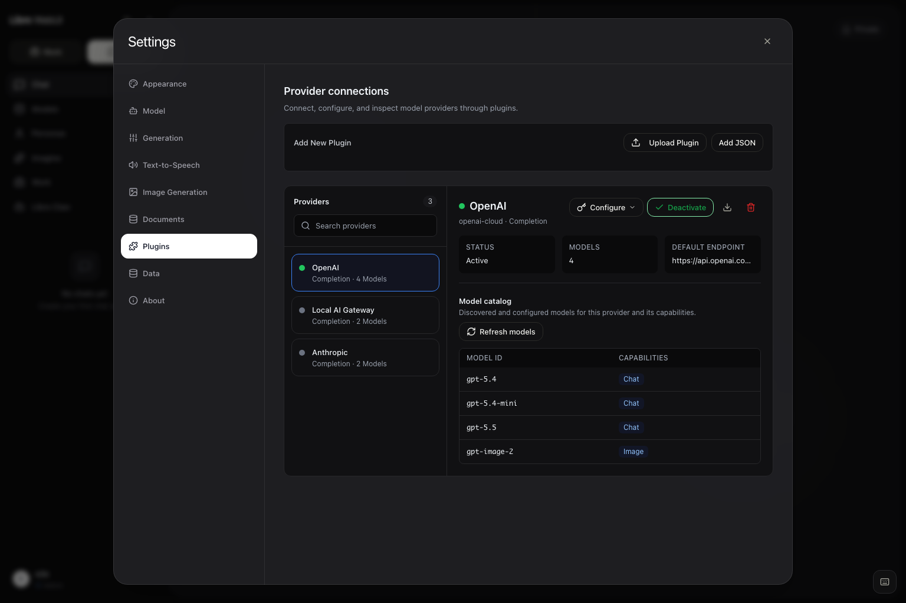

# Connect Third-Party and Self-Hosted Providers

Libre WebUI 0.16.0 adds a focused **Provider connections** workspace inside
**Settings > Plugins**. Use it to activate a bundled provider, point a
compatible plugin at another API, inspect the effective model catalog, or
connect a self-hosted gateway on a trusted network.



Libre WebUI currently ships support for these provider wire formats:

- OpenAI Chat Completions;
- OpenAI Responses;
- Anthropic Messages; and
- Google Gemini contents and function calling.

The bundled Anthropic and Gemini definitions use dedicated adapters selected by
their provider identities. A newly imported provider uses OpenAI Chat
Completions or OpenAI Responses semantics; pointing it at an Anthropic- or
Gemini-compatible API does not select those bundled adapters. A provider with
another request, streaming, tool-call, or response shape needs a backend
adapter. Plugin JSON describes routing and configuration; it does not translate
an unrelated protocol.

## Open Provider Connections

1. Sign in and open **Settings > Plugins**.
2. Search the provider list in the left pane.
3. Select a provider to review its active state and effective model catalog.
4. Activate the provider for your account.
5. Select **Configure** only when you need to save a credential or override a
   connection setting.

Provider configuration is closed by default. Connection settings appear first
for administrators, while sampling controls such as temperature and token
limits remain under the separately collapsed **Advanced parameters** section.
Inherited defaults appear as hints rather than pre-filled account overrides.

Plugin definitions are shared instance configuration, so only administrators
can import, install, update, or delete them. Each authenticated user controls
their own activation state, credential, and allowed generation settings.

## Add a Connection Quickly

**Settings > Connections** is a shorter path for the common case: one
OpenAI-compatible endpoint, one API key. Administrators see a card for the
local Ollama runtime with its health and version, a list of the existing
OpenAI-compatible connections, and a small form to add another.

Adding a connection takes a display name, the full chat completions URL, and
an optional API key. Libre WebUI derives the connection ID from the name,
installs the provider definition, stores the key server-side, activates the
connection, and asks the endpoint which models it serves. The discovered
models replace the placeholder catalog and appear in the chat model picker.

Each row carries the endpoint, the model count, whether a key is stored, an
active toggle, a model refresh, and a delete. Anything beyond this — response
API modes, base URL overrides, per-capability catalogs, generation parameter
policy — still lives in the fuller **Settings > Plugins** workspace described
above.

## Codex (ChatGPT Sign-In)

The bundled **Codex (ChatGPT)** provider needs no API key. When the server has
a Codex CLI sign-in (`codex login` as the server's operating-system user), the
provider appears to administrators, offering GPT-6 Astra, GPT-5.6 Sol, Terra,
Luna, GPT-5.5, and GPT-5.3 Codex Spark through the ChatGPT session, subject to
the signed-in account's model access. Access tokens are read from the CLI's own
`auth.json`, refreshed through the same OAuth client the CLI uses, and written
back so the CLI keeps working; token values never appear in logs.

Because the requests are made by the backend — never from inside a task
container — these models also power Work with the normal sandboxed tool loop.
The provider is administrator-only since every call spends the server owner's
ChatGPT subscription. Hide it entirely with `CODEX_OAUTH_MODELS_ENABLED=false`,
or point at a different sign-in with `CODEX_HOME`.

## Choose a Bundled or Imported Provider

Libre WebUI includes definitions for OpenAI, Anthropic, Gemini, Groq, Mistral,
OpenRouter, Kimi Code by Moonshot AI, Hugging Face, GitHub Models, local MLX LM,
and other model or media services. Start with a bundled entry when its protocol
and authentication contract match the service you want to use.

For another compatible service, an administrator can import a plugin JSON
definition. This minimal example describes an OpenAI-compatible gateway:

```json
{
  "id": "private-ai-gateway",
  "name": "Private AI Gateway",
  "type": "completion",
  "endpoint": "http://ai-gateway:8080/v1/chat/completions",
  "api_mode": "chat_completions",
  "auth": {
    "header": "Authorization",
    "prefix": "Bearer ",
    "key_env": "PRIVATE_AI_GATEWAY_API_KEY"
  },
  "model_map": ["gateway-chat"]
}
```

Import the file from **Settings > Plugins**, activate it, and save the API key
for the account that will use the connection. Add connection variables to the
definition when administrators need editable Base URL, path, discovery, or
capability-specific endpoint fields. The bundled
[`plugins/openai.json`](https://github.com/libre-webui/libre-webui/blob/main/plugins/openai.json)
is a complete example.

For an intentionally authless gateway on a trusted network, set both
`auth.header` and `auth.key_env` to empty strings and omit `auth.prefix`. Libre
WebUI then does not require or send an API key for that plugin.

## Choose Chat Completions or Responses

OpenAI-compatible completion plugins can use either API mode:

| API mode           | Default request path | Typical request field |
| ------------------ | -------------------- | --------------------- |
| `chat_completions` | `/chat/completions`  | `messages`            |
| `responses`        | `/responses`         | `input`               |

The bundled OpenAI provider exposes **API Mode** in its configuration. Libre
WebUI maps completed and streamed Responses output back into Chat and Work,
including bounded replay state for reasoning and tool calls.

Changing the mode affects the default operation path. It does not change the
protocol spoken by the upstream server, so select Responses only when that
server implements compatible Responses request and event shapes.

## Configure a Base URL or Full Endpoint

Libre WebUI resolves a completion route in this order:

1. A non-default full `endpoint` override.
2. `base_url` plus an optional `api_path`.
3. The endpoint declared by the plugin definition.

Use **Base URL** for the API root:

```text
https://gateway.example/v1
```

With no custom path, Chat Completions mode sends requests to:

```text
https://gateway.example/v1/chat/completions
```

Responses mode instead sends them to:

```text
https://gateway.example/v1/responses
```

Use **API Path** when the provider exposes a compatible operation at another
path relative to that root. Use **Legacy Full Endpoint** only when you need to
provide the complete operation URL; a genuine full endpoint takes precedence
over Base URL and API Path.

Known `/chat/completions`, `/completions`, and `/responses` endpoint suffixes
also identify the request semantics. A custom, unrecognized operation path
keeps the explicitly selected API mode.

After a route or API-key change, save the provider again before testing Chat.
When the plugin declares authentication, a custom connection route requires a
credential saved by the same account. An intentionally authless plugin can
leave both authentication fields empty. Libre WebUI does not send an
operator-managed environment key to a user-defined destination; environment
fallback is reserved for the trusted bundled route.

## Discover or Maintain Model IDs

Select an active chat provider and use **Refresh models** to run discovery.
Libre WebUI reloads both the selected provider's catalog and Chat's model list.

Discovery also runs without being asked: an active provider's catalog is
rediscovered when it is missing or has aged past
`PLUGIN_MODEL_DISCOVERY_TTL_MS`, so the models you see follow the provider
rather than the moment you activated it. **Refresh models** forces a check
immediately and reports what happened:

| Result                      | Meaning                                                                     |
| --------------------------- | --------------------------------------------------------------------------- |
| Catalog updated             | The provider answered and its model list differs from the stored one        |
| Catalog already up to date  | The provider answered with the same list                                    |
| API key needed              | No usable key, so no request was made — the previous catalog is still shown |
| Catalog could not be loaded | The provider was unreachable or returned nothing usable                     |

A key set only in the environment is not used for a provider that runs an
installed definition instead of the bundled one; the message says so when that
applies. Speech, image, and embedding models found in a provider's catalog are
listed here with their capability labels, but are kept out of the chat model
picker.

For an OpenAI-compatible route, discovery chooses the model-list URL as
follows:

- a route ending in `/models` is used as-is;
- a known operation suffix such as `/chat/completions`, `/completions`,
  `/responses`, `/embeddings`, or `/messages` is replaced with `/models`; and
- otherwise, `/models` is appended to the route.

For example, both of these completion routes derive the same discovery URL:

```text
https://gateway.example/v1/chat/completions
https://gateway.example/v1/responses

-> https://gateway.example/v1/models
```

When derivation cannot produce the correct full URL, expose
`models_endpoint` in the plugin's `variables` array:

```json
{
  "name": "models_endpoint",
  "type": "string",
  "label": "Models Endpoint",
  "default": "https://gateway.example/v1/models"
}
```

The inherited default or administrator-saved value takes precedence over the
derived address. A top-level `models_endpoint` manifest property is not read.
Discovery expects an OpenAI-compatible response with model objects in a `data`
array:

```json
{
  "data": [{ "id": "gateway-chat" }, { "id": "gateway-code" }]
}
```

Discovered IDs are stored per user and do not rewrite the shared plugin file.
If the provider does not implement compatible discovery, maintain fallback
model IDs in the plugin JSON `model_map`. The catalog in Provider connections
is read-only; capability labels describe which plugin route lists a model and
are not health checks.

Model IDs are not globally unique. Chat stores the raw model ID together with
its exact Ollama or plugin provider identity, so an Ollama model and multiple
plugins can safely expose the same name. If the saved provider becomes
unavailable, Libre WebUI shows that selection as unavailable instead of
silently routing the request to another provider.

## Configure Image Generation Separately

The bundled OpenAI provider exposes image generation through
`https://api.openai.com/v1/images/generations` and currently defaults new
configurations to `gpt-image-2`. Older GPT Image IDs remain in its fallback
catalog for compatible existing deployments.

Chat and image routes are intentionally isolated. A custom Chat Base URL does
not automatically receive image requests. Leave `image_endpoint` blank to use
the image endpoint declared by the plugin, or set it to the complete compatible
Image API operation URL when your provider supplies one.

Image choices are provider-qualified, just like Chat choices. If two active
plugins expose the same image model ID, Libre WebUI sends the request only to
the provider selected in the image panel.

## Connect an HTTP Gateway Safely

Provider endpoints can use absolute HTTP or HTTPS URLs. HTTP is useful for a
self-hosted gateway on a trusted LAN, Tailscale network, or private container
network, but it sends API keys, prompts, tool results, and generated content
without transport encryption. Prefer HTTPS whenever the route crosses a
network boundary or the gateway supports TLS.

Requests originate from the Libre WebUI backend, not from the browser. Choose
an address that is reachable from that backend:

| Backend location              | Example provider root                 |
| ----------------------------- | ------------------------------------- |
| Native process, same machine  | `http://127.0.0.1:8081/v1`            |
| Docker Compose service        | `http://ai-gateway:8080/v1`           |
| Container to supported host   | `http://host.docker.internal:8081/v1` |
| Trusted LAN or Tailscale host | `http://192.168.1.20:8081/v1`         |

Inside a container, `localhost` identifies the Libre WebUI container itself.
It does not identify another Compose service or automatically reach the host.

Libre WebUI accepts only HTTP and HTTPS provider URLs, validates the final
destination before selecting a credential, and does not follow redirects for
provider or discovery requests. Configure the final operation URL directly.

## Verify the Gateway Before Activating It

Test model discovery from the machine or container that runs the Libre WebUI
backend:

```bash
curl http://ai-gateway:8080/v1/models \
  -H 'Authorization: Bearer YOUR_GATEWAY_KEY'
```

Then test the operation matching the selected API mode.

Chat Completions:

```bash
curl http://ai-gateway:8080/v1/chat/completions \
  -H 'Authorization: Bearer YOUR_GATEWAY_KEY' \
  -H 'Content-Type: application/json' \
  -d '{
    "model": "gateway-chat",
    "messages": [{"role": "user", "content": "Reply with: ready"}],
    "stream": false
  }'
```

Responses:

```bash
curl http://ai-gateway:8080/v1/responses \
  -H 'Authorization: Bearer YOUR_GATEWAY_KEY' \
  -H 'Content-Type: application/json' \
  -d '{
    "model": "gateway-chat",
    "input": "Reply with: ready",
    "store": false
  }'
```

After both calls work, configure the same route, mode, credential, and model ID
in Provider connections. Activate the provider, select **Refresh models**, and
then choose its provider-qualified model in Chat. Work can also use it when the
model reliably supports tool calling.

## Troubleshooting

| Symptom                                     | Check                                                                                                                   |
| ------------------------------------------- | ----------------------------------------------------------------------------------------------------------------------- |
| Requests still reach the bundled endpoint   | Remove a stale full endpoint override, then save the intended Base URL and API Path.                                    |
| The provider receives the wrong payload     | Match API Mode to the upstream Chat Completions or Responses protocol and verify the final suffix.                      |
| Refresh models returns no IDs               | Test `/models`, verify the `data[].id` shape, expose/configure the `models_endpoint` variable, or maintain `model_map`. |
| A previous model remains after a route edit | Save the connection change; Libre WebUI clears that user's obsolete discovered catalog before refreshing.               |
| The API key is reported missing             | Save a per-user credential for the custom route; bundled environment fallback does not follow overrides.                |
| A Docker deployment cannot reach localhost  | Use the gateway's Compose service name, a supported host alias, or a reachable private-network address.                 |
| Chat works but image generation does not    | Configure the separate complete `image_endpoint` and select a model exposed by that image capability.                   |
| Chat works but Work rejects the model       | Confirm the model supports compatible tool calls; ordinary text completion is not sufficient.                           |
| The provider returns a redirect             | Configure the final validated URL directly; Libre WebUI intentionally does not follow provider redirects.               |

For detailed routing, credential, replay-state, and authorization behavior,
read [Plugins](./PLUGIN_ARCHITECTURE). For deployment-specific failures, see
[Troubleshooting](./TROUBLESHOOTING).

## Community Acknowledgment

This guide and Libre WebUI 0.16.0's Provider connections experience were
shaped by [ZhengJin (@fangzhengjin)](https://github.com/fangzhengjin), whose
detailed third-party-provider feedback and AI-assisted UX concept in
[#163](https://github.com/libre-webui/libre-webui/issues/163) helped define the
workflow.

## Related Docs

- [Plugins](./PLUGIN_ARCHITECTURE)
- [Working with Models](./WORKING_WITH_MODELS)
- [MLX LM on Apple Silicon](./MLX_APPLE_SILICON)
- [Work: Isolated Workspaces](./WORKSPACES)
- [Troubleshooting](./TROUBLESHOOTING)
