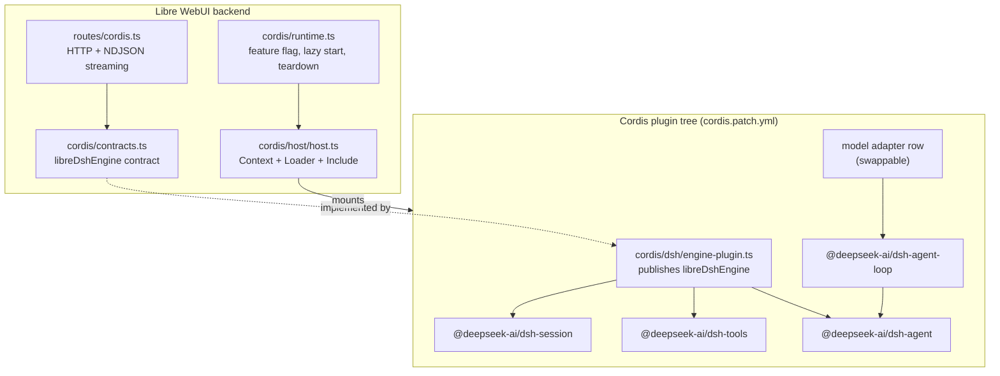
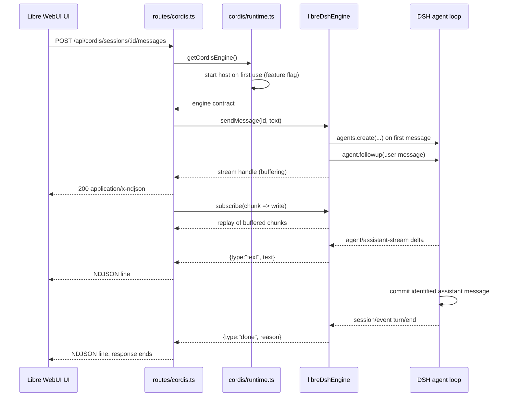
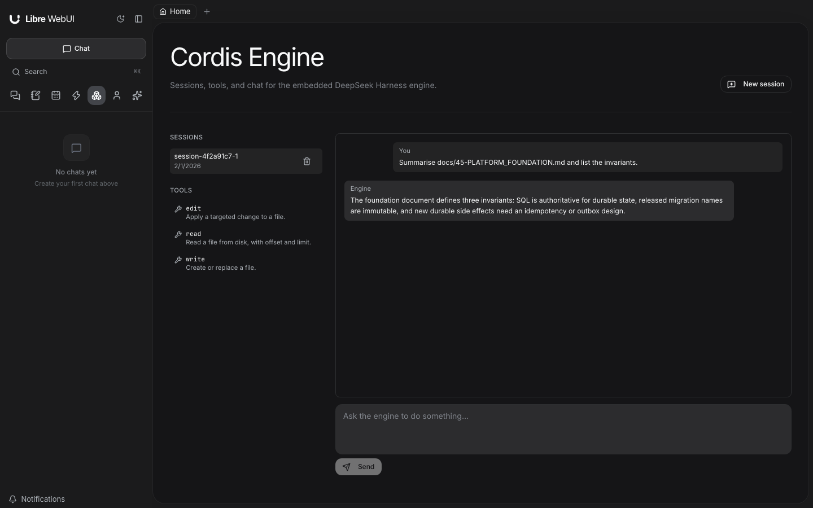

# Cordis Bridge

The Cordis bridge embeds the DeepSeek Harness (DSH) engine inside Libre WebUI's
backend. DSH runs as a plugin tree inside a
[Cordis](https://github.com/cordiverse/cordis) runtime hosted by Libre WebUI, so
its capabilities arrive as Cordis services rather than as imported modules.

The bridge is **off by default**. Nothing on this page happens until an operator
enables it (see [Cordis Configuration](./65-CORDIS_CONFIGURATION.md)).

## Why a bridge instead of a direct integration

Importing DSH's packages from Libre WebUI's services would be shorter and worse.
A direct import makes the engine a compile-time dependency, so changing a model
adapter, swapping the agent loop, or removing the engine means editing and
redeploying Libre WebUI.

The bridge inverts that. Libre WebUI depends on one abstract contract, and a
Cordis composition document decides what satisfies it:

- **Retarget without a rebuild.** The composition is a YAML file, so pointing
  the engine at a different provider is a configuration change.
- **Configure capabilities.** Each capability is a loader row. Changes to the
  operator-maintained composition take effect the next time the host starts.
- **Remove cleanly.** Every service, listener, and effect the engine installs is
  owned by the root fiber. Disposing that fiber rolls all of it back, so an
  operator can stop the engine without restarting Libre WebUI.

## Layers

Concrete DSH dependencies stay inside `backend/src/cordis/dsh/`. Routes and
application services consume the bridge contracts. The Work driver has a
separate in-memory composition and never mounts the host filesystem plugins.

## Contracts

The contract lives in `backend/src/cordis/contracts.ts`. It is deliberately
narrow: the shapes Libre WebUI's API needs, expressed without engine vocabulary.

| Contract                                             | Purpose                                                                           |
| ---------------------------------------------------- | --------------------------------------------------------------------------------- |
| `DshEngine.status()`                                 | Lifecycle state of each engine service (`pending` / `ready` / `failed`)           |
| `DshEngine.modelConfiguration()`                     | Model and provider defaults of the running composition                            |
| `DshEngine.listSessions()`                           | Session summaries, newest first                                                   |
| `DshEngine.getSession(id)`                           | One session with its projected messages                                           |
| `DshEngine.createSession(opts)`                      | Reserve a session id and working directory                                        |
| `DshEngine.updateSessionSettings(id, settings)`      | Persist the real model selection and native filesystem permission mode while idle |
| `DshEngine.decideApproval(id, approvalId, decision)` | Resolve one pending native tool approval for its owning session                   |
| `DshEngine.deleteSession(id)`                        | End a session and dispose its agent                                               |
| `DshEngine.listAgents()`                             | Live agents, flagged as root or child                                             |
| `DshEngine.listTools()`                              | Model-facing tools the engine registered                                          |
| `DshEngine.sendMessage(id, txt)`                     | Start a turn and return a stream handle                                           |
| `DshEngine.cancel(id)`                               | Cancel the in-flight turn for a session                                           |

The contract is published as the Cordis service `libreDshEngine`, so a consumer
reads it with `ctx.get('libreDshEngine')` and never imports the bridge module.

`EngineStreamChunk` carries `text`, `reasoning`, `tool-call`, `tool-result`,
`approval-request`, `approval-decision`, `error`, and `done`. Live frames are routed by their owning agent and session;
the matching durable assistant message is not emitted a second time. `sendMessage` returns a handle whose `subscribe`
replays anything already emitted, so a fast first token cannot be lost between
the engine starting the turn and the HTTP handler attaching its listener.

## Sequence: one chat turn

NDJSON is used rather than a WebSocket because a turn is a single
server-to-client sequence after the request. Keeping it on the POST avoids a
second handshake, ticket, and reconnect protocol, and keeps the whole turn
inside one authenticated request.

## DONE and PENDING

Cordis activates a plugin when the services it declares are available, so a row
spends time in states that are not "running yet". Two distinct notions matter,
and confusing them is the most common source of a silent engine.

**Loader entry state.** The Loader tracks each row through
`PENDING → LOADING → ACTIVE`, or `FAILED`. A row whose declared services are
missing stays pending indefinitely rather than failing, which is why an
incomplete composition produces an engine that starts but serves nothing.

**Service availability.** The host reports each expected service as:

| State     | Meaning                       | Cause                                               |
| --------- | ----------------------------- | --------------------------------------------------- |
| `pending` | Not registered on the context | The providing row has not activated, or is disabled |
| `ready`   | Registered and usable         | The providing row activated                         |
| `failed`  | Declared but unusable         | Reported with a `detail` string                     |

`host.status()` lists every expected service with its availability and names the
required ones that are missing; `GET /api/cordis/health` exposes the same
information. A composition that omits a required service makes startup throw
rather than publish an engine that answers with empty lists.

Two dependency chains are easy to get wrong:

- `dsh-tools` cannot start without `systemPrompt`.
- `dsh-agent-loop` cannot start until `agents`, `sessions`, `llm`, `tools`,
  `systemPrompt`, and `sessionProjections` all exist.

A composition missing any of those produces a working session store and an
engine that never answers a message.

## Provider configuration

The shipped `libre-webui-llm-adapter` row serves the model providers configured
in Libre WebUI. The Engine page's model picker selects a provider model for a
session without replacing that row.

Changes to plugin rows in the composition apply on the next host start. Restart
the backend, or disable and re-enable Cordis when the administrator toggle is
unlocked. Persisted sessions remain in the configured store and resume through
the current composition.

Trusted integration code can use Cordis Loader lifecycle APIs directly. The
bridge does not expose an adapter-swap endpoint or automatically restore a
previous adapter when a replacement fails.

## Rollback

Disposing the host's root fiber removes everything the engine installed. That
single ownership edge is the whole guarantee, and it holds because:

- Services are registered by plugins, so they are withdrawn with their fiber.
- `session/event` subscriptions are registered inside the bridge's own
  constructor and belong to the bridge row's fiber.
- Agent handles are tracked by the bridge and disposed in its teardown effect.
- The host disposes the root context, which owns every row.

`stopCordisHost()` is idempotent, and it is wired into the backend's shutdown
sequence so the engine's timers and file handles are released rather than left
to process exit.

## Session identity and persistence

The Engine page reserves an opaque session ID at creation. With persistence on,
its header is immediately stored, so even an empty session survives restart.
The bridge lists both stored and live sessions, reads stored logs through DSH's
validated persistence API, and resumes the agent on the same ID for a follow-up.
New user messages use DSH's identified-message constructor.

Deleting a session cancels and disposes its agent before removing its artifact.
The local JSONL deletion adapter validates the store and session paths and
rejects symlinks. Custom persistence backends without deletion support return an
error instead of claiming that data was removed.

Cancellation reaches the native agent, model request, and tool work. A client
that disconnects cancels its turn; completed messages remain readable. Buffered
stream replay is bounded and preserves a fast response before a reader attaches.

The host Engine is a **single-replica solo feature**. Team deployments cannot
mount its local JSONL runtime. Sandboxed Work uses its existing SQL-backed task,
run, message, approval, and event repositories instead.

## HTTP surface

| Method   | Path                                | Purpose                          |
| -------- | ----------------------------------- | -------------------------------- |
| `GET`    | `/api/cordis/health`                | Bridge state; unauthenticated    |
| `GET`    | `/api/cordis/sessions`              | List sessions                    |
| `POST`   | `/api/cordis/sessions`              | Create a session                 |
| `GET`    | `/api/cordis/sessions/:id`          | Read a session with its messages |
| `DELETE` | `/api/cordis/sessions/:id`          | End a session                    |
| `POST`   | `/api/cordis/sessions/:id/messages` | Send a message, stream NDJSON    |
| `POST`   | `/api/cordis/sessions/:id/cancel`   | Cancel the in-flight turn        |
| `GET`    | `/api/cordis/agents`                | List live agents                 |
| `GET`    | `/api/cordis/tools`                 | List registered tools            |

Every route except `/health` requires an authenticated administrator session and answers
`503` with a `code` of `CORDIS_DISABLED`, `CORDIS_STARTING`, or
`CORDIS_UNAVAILABLE` while the bridge cannot serve requests.

The page is `frontend/src/pages/CordisPage.tsx`, reachable at `/cordis` from
the sidebar. It lists sessions and registered tools, creates sessions, and
streams a turn into the transcript. When the bridge is off or cannot start it
renders the reason instead of an empty list, because "no sessions" and "no
engine" look identical otherwise.

The browser client is `frontend/src/utils/api/cordisApi.ts`. It talks to this
surface only — it imports no backend type and no `@deepseek-ai/*` package — so
the engine stays swappable without a frontend change. A turn is consumed with
`sendMessage(sessionId, text, { onChunk })`; the client parses the
newline-delimited JSON itself and tolerates chunks split across network reads.

## Engine chat controls

The Engine page renders Markdown, tables, and syntax-highlighted code blocks,
with copy controls for replies and code. System prompts and injected runtime
context are grouped under a collapsed **Session context** disclosure; they are
not shown as messages authored by the user. Exposed reasoning and tool activity
have separate disclosures, and tool results remain paired with the correct
operation after reload.

Choose an actual provider model in the composer. The picker uses the signed-in
administrator's available local and plugin models, including provider identity.
Chat persona and agent selections are not model IDs and do not inject their
instructions into an Engine conversation. Old failed persona-model headers are
ignored as default-model hints without changing the saved log.

Each session has its own **Read-only** or **Workspace write** setting, enforced
by DSH's filesystem policy and the bridge's canonical workspace boundary. The
composer shows the workspace scope. Settings are saved as native session events
and survive restart; changes are refused while a turn is active.

A native escalation request appears as an **Allow once** / **Deny** card attached
to the operation. Approval applies to that request only and leaves the standing
permission mode unchanged. Stale or cancelled requests cannot be approved, and
headless Chat calls reject questions they cannot present. The bridge does not
offer unrestricted host access.

The additional administrator endpoints are:

| Method  | Path                                             | Purpose                                                      |
| ------- | ------------------------------------------------ | ------------------------------------------------------------ |
| `GET`   | `/api/cordis/models`                             | Available provider models and the current real-model default |
| `PATCH` | `/api/cordis/sessions/:id/settings`              | Set this session's model and/or permission mode              |
| `POST`  | `/api/cordis/sessions/:id/approvals/:approvalId` | Decide one pending request with `allowed-once` or `rejected` |

## Using the engine in Chat

Enable both **Access & policies → Agent CLI models** and **Cordis Engine**. Administrators
can then select **DeepSeek Harness** in Chat. Each request gets a fresh transient
engine session containing that Chat request's supplied transcript. The normal
Chat database remains authoritative; unrelated conversations, forks, and retries
cannot share an invisible engine history. The transient engine log is removed
after completion or cancellation, and does not appear in the Engine page.

The standard provider composition also lists **DeepSeek Harness · model
(provider)** choices in the Agents group. Their saved IDs wrap the same qualified
provider route used by the Engine page: `dsh:lwui:ollama:<model>` or
`dsh:lwui:plugin:<plugin>:<model>`, with each provider component percent-encoded.
An optional [local native DSH connection](./65-CORDIS_CONFIGURATION.md#connect-models-from-a-running-dsh-instance)
adds `dsh:native:<provider>:<model>` choices from that instance's live model
catalog. These reuse the native provider's configuration and credentials.
Native calls also appear in **Provider Usage** with their selected model,
reported tokens, latency, and result status.
The base `dsh` profile retains the running composition's default model. Custom
adapter compositions expose that base profile without advertising unsupported
Libre WebUI provider overrides.

Titles and thinking summaries resolve a DSH selection into its underlying
provider and make a direct text request without tools or an agent session. A
base-profile request reads the running engine's defaults, including bridge-row
overrides, instead of guessing from the current provider catalog. Custom adapters
need an explicitly configured Ollama or plugin task model for these features.
An unavailable selected provider produces the normal failure or local title
preview; it does not cause a request to a different provider.

The authenticated administrator's provider settings and credentials serve the
request. No other administrator's credentials are selected implicitly. The
configured Cordis workspace remains the default; Chat does not substitute the
server user's home directory.

## Sandboxed Work

When Cordis is enabled, Work offers a separate **Engine** control with
**Libre WebUI** and **DeepSeek Harness** choices. The model picker keeps its
normal model names and provider identities. Internally, the DSH selection is
stored as `dsh:<model>` for LWUI-backed providers. Native DSH choices instead
store `providerType: dsh`, the exact native provider ID, and the raw model ID.
The normal tool-capability and access checks still apply; native credentials
add an active-administrator requirement.

Each run creates an isolated, in-memory DSH agent loop. Its model adapter receives
the current Work transcript, provider metadata, images, and tool schemas. Its
tool bodies only wait for the results returned by Work; they cannot read host
files or start host processes.

Work remains responsible for validating arguments, requesting approvals,
executing tools in the workspace runtime, recording results and provider replay
state in SQL, enforcing budgets, and publishing events. A denied tool produces
the normal denial result. Cancellation disposes DSH and follows Work's existing
container cleanup. After worker recovery, a fresh DSH driver receives the restored
Work context and does not replay completed tool side effects.

The Work integration does not need the host Engine composition or JSONL session
store. It follows Work's existing Docker/Kubernetes runtime and deployment rules,
including the shared persistence requirements of team mode.

## Security boundary

The Engine page and host-side Chat agent are administrator-only. Engine sessions
are a shared administrator console, including their system prompts; they are
not a per-user workspace. Ordinary accounts cannot read, create, mutate, or
cancel them through the API.

The shipped host filesystem tools confine reads and writes to the configured
workspace using canonical filesystem targets, including symlink resolution.
Session working-directory overrides must remain inside that workspace. Native
DSH mutation policy and one-shot Engine approval decisions still apply.
Operator-installed composition plugins are trusted server code and can grant
additional capabilities. Engine approvals are separate from Work's approval
and container-execution flow.

Work's DSH driver is separate: it mounts no host filesystem, shell, or persistence
plugins and can execute only through Work's existing authorization and sandbox.
Remote model providers remain opt-in and use the selected account's configured
provider route.
